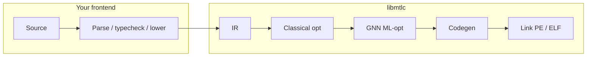

<div align="center">

# libmtlc

**A from-scratch compiler backend.**

Custom IR. Classical + GNN optimizers. Native codegen. Native linking.
Any frontend that lowers to the IR can drive the pipeline.

[](LICENSE)
&nbsp;
&nbsp;

[**API**](include/mtlc/) · [**Docs**](docs/) · [**Mettle**](docs/LANGUAGE.md) · [**GitHub**](https://github.com/The-Mettle-Project/Mettle)

</div>

---

**libmtlc** is a reusable native compiler backend. Frontends lower into its IR; the library owns optimize, codegen, and link.

**Mettle** is the reference frontend: a systems language that exercises the full stack.

| | |
|--|--|
| **libmtlc** | IR, optimizers, codegen (x86-64 / ARM64 / PTX / SPIR-V), PE/ELF linking. Public C API in [`include/mtlc/`](include/mtlc/). |
| **mettle** | Reference language + driver. Lowers `.mettle` into libmtlc IR. |

No VM. Hand-encoded ISA. Own PE linker on Windows. Backend never includes frontend headers.

## Pipeline



## Quick start

```bash
# Linux
curl -fsSL https://raw.githubusercontent.com/The-Mettle-Project/Mettle/main/install.sh | sh
```

```powershell
# Windows
irm https://raw.githubusercontent.com/The-Mettle-Project/Mettle/main/install.ps1 | iex
```

```bash
mettle --build hello.mettle -o hello
```

## Build from source

```powershell
# Windows → bin\mtlc.lib + bin\mettle.exe
.\build.bat
.\tests\run_tests.ps1
```

```bash
# Linux → bin/libmtlc.a + bin/mettle
make
make libmtlc   # backend only
bash tools/test-elf-native.sh
```

## Docs

[libmtlc reference](docs/libmtlc/README.md) · [Write a frontend](docs/embedding.md) · [Language](docs/LANGUAGE.md) · [Compilation](docs/compilation.md) · [ML-opt](docs/ml-opt.md) · [GPU](docs/gpu.md) · [Borrow checker](docs/borrow-checker.md) · [C interop](docs/c-interop.md) · [Limitations](docs/known-limitations.md) · [Contributing](CONTRIBUTING.md)

## License

Apache-2.0. See [LICENSE](LICENSE).
