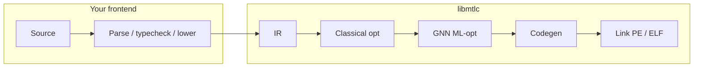

<div align="center">

# libmtlc

**A from-scratch compiler backend.**

Custom IR. Classical + GNN optimizers. Native codegen. Native linking.
Any frontend that lowers to the IR can drive the pipeline.

[](LICENSE)
&nbsp;
&nbsp;

[**API**](include/mtlc/) · [**Reference**](docs/libmtlc/README.md) · [**Docs**](docs/) · [**Mettle**](docs/LANGUAGE.md) · [**GitHub**](https://github.com/The-Mettle-Project/Mettle)

</div>

---

**libmtlc** is a reusable native compiler backend. Frontends lower into its IR; the library owns optimize, codegen, and link.

**Mettle** is the reference frontend: a systems language that exercises the full stack.

| | |
|--|--|
| **libmtlc** | IR, optimizers, codegen (x86-64 / ARM64 / PTX / SPIR-V), PE/ELF linking. Public C API in [`include/mtlc/`](include/mtlc/). Ships as `bin/mtlc.lib` (Windows) or `bin/libmtlc.a` (Linux). |
| **mettle** | Reference language + driver. Lowers `.mettle` into libmtlc IR, then drives the backend. |

No VM. No LLVM. No external assembler. Hand-encoded ISA. Own PE linker on Windows. The backend never includes a frontend header.

## Pipeline



## What libmtlc does

| Stage | |
|--|--|
| **IR** | A typed IR with a module type registry and symbol table. Build it through the public builder in [`mtlc/build.h`](include/mtlc/build.h), or lower into it directly. |
| **Optimizer** | A classical fixpoint pipeline: inlining, CSE, constant and copy propagation, folding, branch cleanup, LICM, loop unrolling, SROA, and AVX2 auto-vectorization of map/reduce loops. |
| **ML-opt** | A graph neural network proposes rewrites; each is applied only if a reference interpreter proves it preserves behavior (translation validation). Opt-in; default builds ship no model. |
| **Codegen** | Hand-encoded machine code for four targets. No assembler in the path. |
| **Linker** | Its own PE linker on Windows, resolving imports by DLL name with no SDK import libraries; ELF via the system C toolchain. |

## Targets

`mtlc_emit(ctx, module, arch, path)` reaches every backend:

| Target | `MtlcArch` | Product |
|--|--|--|
| x86-64 (+ AVX2) | `MTLC_ARCH_X86_64` | host-format relocatable object, or a linked executable |
| AArch64 | `MTLC_ARCH_ARM64` | self-contained static ELF executable |
| NVIDIA PTX | `MTLC_ARCH_PTX` | PTX text module, one kernel per function |
| SPIR-V (OpenCL 1.2) | `MTLC_ARCH_SPIRV` | binary module, one kernel per function |

## Use it from your frontend

Include only [`include/mtlc/`](include/mtlc/) and link only the library. This program builds IR, optimizes it, and writes a native executable:

```c
#include <mtlc/build.h>
#include <mtlc/pipeline.h>

int main(void) {
  const MtlcType *i64 = mtlc_type_scalar(MTLC_TYPE_INT64);
  MtlcBuilder *b = mtlc_builder_create();

  /* fn main() -> int64 { return 40 + 2; } */
  MtlcFn *fn = mtlc_builder_function(b, "main", i64, NULL, NULL, 0, 0);
  MtlcValue sum = mtlc_binary(fn, "+", mtlc_const_int(fn, i64, 40),
                              mtlc_const_int(fn, i64, 2), i64);
  mtlc_return(fn, sum);

  MtlcModule *m = mtlc_builder_finish(b);
  MtlcContext *ctx = mtlc_context_create();
  mtlc_optimize(ctx, m);                       /* classical + optional GNN passes */
  mtlc_build_executable(ctx, m, "out.exe");    /* native binary, no external toolchain */
  return 0;
}
```

```bash
# Windows (after .\build.bat)
gcc -Iinclude app.c bin/mtlc.lib -o app.exe -ldbghelp

# Linux (after `make libmtlc`)
cc -Iinclude app.c bin/libmtlc.a -o app
```

The produced `out.exe` exits with code 42. See the [getting-started guide](docs/embedding.md) and the full [API reference](docs/libmtlc/api.md).

## Frontend-agnostic, proven

The backend carries no dependency on the Mettle frontend, and three suite gates enforce and demonstrate it:

- **`libmtlc_selfcontained`** fails the build if the archive's external symbol closure reaches into frontend or driver code.
- **`calc_frontend`** builds a second, non-Mettle frontend, [`examples/calc`](examples/calc/) (a tiny C-like language in one file), against the library alone and runs the executable it produces.
- **`public_api`** drives the full public API through globals, extern libc calls, pointer memory, casts, and all four targets, then runs the native result.

## The Mettle frontend

To use the reference language instead of building your own, install the toolchain:

```bash
# Linux
curl -fsSL https://raw.githubusercontent.com/The-Mettle-Project/Mettle/main/install.sh | sh
```

```powershell
# Windows
irm https://raw.githubusercontent.com/The-Mettle-Project/Mettle/main/install.ps1 | iex
```

```bash
mettle --build hello.mettle -o hello
```

See the [language reference](docs/LANGUAGE.md) and [compilation options](docs/compilation.md).

## Build from source

```powershell
# Windows: bin\mtlc.lib + bin\mettle.exe
.\build.bat
.\tests\run_tests.ps1
```

```bash
# Linux: bin/libmtlc.a + bin/mettle
make
make libmtlc          # backend only
bash tools/test-elf-native.sh
```

Both builds require GCC or Clang (C99). Windows is the primary target and what CI runs in full.

## Layout

```
include/mtlc/   public backend API (the only headers a frontend includes)
src/ir/         IR core, classical + GNN optimizer, type IR
src/codegen/    x86-64 · ARM64 · PTX · SPIR-V  (no frontend includes)
src/linker/     COFF/PE + ELF linking
src/mtlc_*.c    public API, IR builder, self-containment fallbacks
src/lexer, parser, semantic, main.c   the Mettle reference frontend + driver
examples/calc/  a second, non-Mettle frontend over the public API
```

## Docs

[libmtlc reference](docs/libmtlc/README.md) · [Write a frontend](docs/embedding.md) · [API](docs/libmtlc/api.md) · [IR model](docs/libmtlc/ir.md) · [Types](docs/libmtlc/types.md) · [Pipeline](docs/libmtlc/pipeline.md) · [Internals](docs/libmtlc/internals.md)

[Language](docs/LANGUAGE.md) · [Compilation](docs/compilation.md) · [ML-opt](docs/ml-opt.md) · [GPU](docs/gpu.md) · [Borrow checker](docs/borrow-checker.md) · [C interop](docs/c-interop.md) · [Limitations](docs/known-limitations.md) · [Contributing](CONTRIBUTING.md)

## Status

Pre-1.0 (`mtlc_version()` reports `libmtlc 0.1.0`). The public API is usable and exercised end to end, but additions are expected and signatures may still move before 1.0; the headers in [`include/mtlc/`](include/mtlc/) are the source of truth.

## License

Apache-2.0. See [LICENSE](LICENSE).
