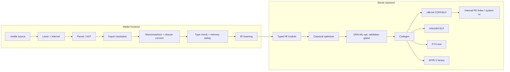
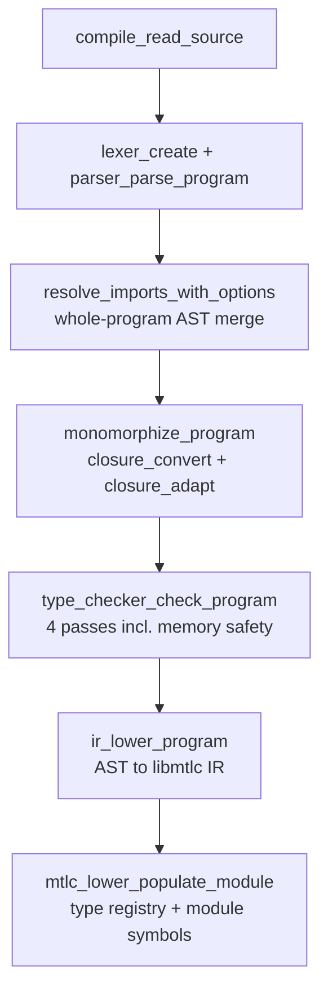

# The Mettle Toolchain, End to End

The single-document deep dive: the Mettle language as it is actually
implemented, and the libmtlc backend as it actually works. It is written
against the source rather than against the other docs, and it records mechanism
(algorithms, data structures, register contracts, instruction sequences) rather
than only intent.

**This document is self-contained.** It is meant to be read start to finish
without opening anything else. Section headers name the implementing source
files so you can go from a description to the code, and a further-reading index
at the end points to the per-topic references, but nothing here depends on
them.

Repository shape in one sentence: `src/lexer`, `src/parser`, `src/semantic`,
`src/frontend`, `src/ir/ir_lower*.c`, and `src/main.c` are the Mettle reference
frontend; `src/ir` (core), `src/codegen`, `src/linker`, `src/compiler`,
`src/error`, and the `mtlc_*.c` root TUs are libmtlc, the frontend-agnostic
backend; `stdlib/` is the standard library; `include/mtlc/` is the only header
surface a foreign frontend ever includes.

**Contents**

- Part I: [Orientation](#part-i-orientation)
- Part II: [The Mettle language](#part-ii-the-mettle-language) (lexical, types, declarations, statements, expressions, decorators, memory, modules, interop, GPU, stdlib, testing, diagnostics)
- Part III: [The frontend implementation](#part-iii-the-frontend-implementation)
- Part IV: [The IR](#part-iv-the-ir)
- Part V: [The optimizers](#part-v-the-optimizers)
- Part VI: [Code generation](#part-vi-code-generation)
- Part VII: [Linking and the runtime](#part-vii-linking-and-the-runtime)
- Part VIII: [libmtlc as a library](#part-viii-libmtlc-as-a-library)
- Part IX: [Driver, verification, and limits](#part-ix-driver-verification-and-limits)

---

# Part I: Orientation

## 1.1 Two products, one tree

**libmtlc** is a from-scratch reusable native compiler backend: a custom typed
IR, a classical fixpoint optimizer, a GNN-driven ML optimizer behind a
translation-validation gate, hand-encoded code generation for four targets
(x86-64 with AVX2, AArch64, NVIDIA PTX, SPIR-V), and its own PE linker on
Windows. No LLVM, no VM, no external assembler, no assembly text anywhere in
the pipeline. It ships as `bin/mtlc.lib` or `bin/libmtlc.a` behind
`include/mtlc/`.

**Mettle** is the reference frontend: a typed, assembly-inspired systems
language whose driver (`bin/mettle`) lowers `.mettle` source into libmtlc IR
and drives the backend end to end.



## 1.2 Design goals, in priority order

1. **Compile speed is the flagship metric.** Roughly 200k LOC in about a
   second. Every structural decision below (interning, indexed scopes,
   version-skipped passes, derived CFGs, hashed symbol tables) exists to
   protect it.
2. **Zero toolchain dependency on Windows.** `mettle --build` goes source to
   `.exe` with only the compiler binary: its own COFF emitter and its own PE
   linker, resolving imports by DLL name so no Windows SDK import libraries
   are needed.
3. **Runtime: none.** A typical compiled program links libc and nothing else.
   No GC, no allocator state, no init or shutdown, no background threads.
4. **The backend must be genuinely reusable.** The boundary is enforced by
   test gates, not convention (section 8.2).

## 1.3 Reading the two boundaries

There are two boundaries worth holding in mind, and they are not the same one:

- The **language/backend boundary** is `src/frontend/`: exactly one TU is
  permitted to see both the frontend `Type` and the backend `MtlcType`.
- The **archive boundary** is what gets compiled into `mtlc.lib`. The Mettle
  lowering TUs live under `src/ir/` but are deliberately excluded from the
  archive; they are frontend code that happens to sit in the IR directory.

---

# Part II: The Mettle language

## 2.1 Lexical structure

Implementation: `src/lexer/lexer.c`.

**Comments.** `//` to end of line; `/* ... */` block comments, which **nest**.
An unterminated block comment is `E0001`.

**Identifiers.** `[A-Za-z_][A-Za-z0-9_]*`, ASCII only, case sensitive, no
Unicode. Identifier-like tokens are interned globally, so later phases compare
names by pointer.

A quirk worth knowing: x86 mnemonics and register names (`add`, `sub`, `mov`,
`cmp`, `call`, `ret`, `push`, `pop`, `lea`, `jmp`, `je`, `eax` through `r15`,
and friends) are lexed as **dedicated tokens** matched case-insensitively, but
`parser_is_identifier_like()` accepts them wherever an identifier is expected.
They are usable as ordinary names; the tokens exist for the reserved inline-asm
syntax.

**Keywords** (case-sensitive):

```
import  import_str  extern  export  var  const  struct  enum  trait  impl  where
method  return  if  else  while  for  switch  case  default  break  continue
defer  errdefer  asm  this  new  fn  match  kernel  dispatch  workgroup  private
barrier
```

plus the type keywords `int8 int16 int32 int64 uint8 uint16 uint32 uint64
float32 float64 string`.

**Contextual names, not keywords:** `in` (range-`for` only), `Fn` (closure type
position), `bool`/`true`/`false` (a builtin type and two pre-registered global
constants), `cstring`, `void`, `sizeof`, `assert`, `assert_eq`, the GPU
built-ins (`thread`, `block`, `block_dim`, `grid_dim`, `subgroup_*`,
`atomic_*`, `tensor_*`), the barrier option words (`workgroup`, `global`,
`acquire`, `release`, `acq_rel`, `seq_cst`), and the import guards (`windows`,
`linux`).

**Numeric literals.** Decimal (`42`, leading zeros stay decimal), hex (`0x1A`),
binary (`0b1010`), float (`3.14`). The radix is retained on the AST node and
feeds default type selection. No digit separators. A leading `-` is never part
of a literal; it is unary minus, which is why `var x: int8 = -128;` is valid.
The lexer deliberately refuses to consume a `.` that begins `..`, so `1..5`
lexes as three tokens.

**Character literals** are `'c'` with escapes `\n \t \r \\ \' \0`, and they
produce a `TOKEN_NUMBER`: a char literal *is* an integer literal, so `'A'` is
exactly `65`.

**String literals** are double-quoted with escapes `\n \t \r \\ \" \0`
processed at lex time. Unknown escapes are preserved literally, both
characters. Raw newlines inside quotes are allowed and stored as LF.

**Operators and punctuation**, complete:

```
=  += -= *= /= %= &= |= ^= <<= >>=
== != < > <= >=
&& || !
+ - * / %
& | ^ ~ << >>
.  ->  ..  ( ) { } [ ]  : ; ,  @
```

There is no `?:`, no `::`, no `=>`, no `#`, no `...`. `..=` is not one token:
it is `..` followed by `=`, which is why inclusive ranges exist only in
range-`for` and never in `switch` cases.

Newlines are significant: `parser_expect_statement_end` accepts a `;` **or** a
newline as a statement terminator.

## 2.2 Types

| Type | Size | Align |
|---|---|---|
| `int8` / `uint8` / `bool` | 1 | 1 |
| `int16` / `uint16` | 2 | 2 |
| `int32` / `uint32` / `float32` | 4 | 4 |
| `int64` / `uint64` / `float64` / pointers / plain enums | 8 | 8 |
| `string` | 16 | 8 |
| tagged enum | tag + largest payload | varies |
| `void` | 0 | 1 |

- **Integer overflow wraps**, signed and unsigned alike. No traps, no
  undefined-overflow assumptions anywhere in the pipeline.
- **Pointers** are `T*`, multi-level, with C pointer arithmetic (`ptr + n`
  scales by pointee size; `ptr1 - ptr2` yields a **byte** offset as `int64`;
  `ptr[i]` is `*(ptr + i)`). Null is written `0`.
- **Aliases**: `cstring` is exactly `uint8*`. `string` is a builtin 16-byte
  struct `{ chars: uint8*, length: uint64 }` at offsets 0 and 8, and it does
  **not** own its buffer.
- **Arrays** `T[N]` are fixed-size stack value types. `N` must be a literal
  number token, not a constant expression or a named `const`. Arrays are never
  passed by value; pass `&arr[0]`.
- **Structs** have declaration-order layout with natural alignment, matchable
  to C by hand. **Plain enums** use an `int64` representation (8 bytes, which
  matters for interop). **Tagged enums** are tag plus largest payload; do not
  assume 8 bytes.
- **Function values** come in two distinct types: thin `fn(T) -> R` is a raw
  C-compatible function pointer; capital `Fn(T) -> R` is a stateful closure, an
  8-byte pointer to a heap environment.
- **Conversions**: widening is implicit; narrowing is **also** implicit for
  int-to-int and float-to-float; nothing is implicit between int and float or
  pointer and int (except literal `0` as null). `(Type)expr` covers the rest.

The type-annotation grammar is: a builtin keyword, identifier,
`fn(...)->R`, or `Fn(...)->R`; then optional `.qualified.name`; then optional
`<TypeArgs>`; then any number of `*`; then one optional `[N]`.

## 2.3 Declarations

### Variables and constants

```mettle
var x: int32;
var y: int32 = 42;
var buf: uint8[1024];
var p: int32* = 0;
var z = 1 + 2;              // ERROR: 'z' requires an explicit type
```

**There is no type inference for bindings.** A `var` with an initializer but no
annotation is rejected. The only two exemptions are structural: the range-`for`
counter, and a top-level integer `const`. Locals must also be definitely
assigned before first read.

```mettle
const MAX: int32 = 100;     // top-level: integer only, folded at every use
const STEP = 4;             // type may be omitted at top level
fn f() -> int32 {
  const RATE: float64 = 1.5;   // local const: any type, but type is REQUIRED
  return MAX;
}
```

Top-level `const` is integer-only and zero-storage; its initializer must be a
compile-time constant integer expression (literals, `sizeof`, earlier consts,
arithmetic over them). Global float, string, and aggregate constants are not
supported; use a top-level `var` or a function-local `const`.

### Functions

```mettle
fn add(a: int32, b: int32) -> int32 { return a + b; }
fn greet() { }                        // omitted return type means void
fn legacy(a: int32): int32 { ... }    // ':' accepted as return separator
fn forward(a: int32) -> int32;        // forward declaration
```

Parameters are `name: Type` only: **no defaults, no varargs, no named
arguments** at the user level. No overloading. `main` with signature
`() -> int32` is the entry point.

### Generics, traits, impls

```mettle
fn swap<T>(a: T*, b: T*) -> void { var tmp: T = *a; *a = *b; *b = tmp; }
fn add_one<T: Addable>(v: T) -> T where T: SignedNumber { return v + 1; }
swap<int32>(&x, &y);            // call sites MUST supply type arguments

trait Addable;                  // marker trait
impl Addable for int32;         // marker impl

trait Incrementable { fn next_value(self: Self) -> Self; }   // no body allowed
impl Incrementable for int32 {
  fn next_value(self: Self) -> Self { return self + 1; }     // body required
}
```

Inline bounds, multiple bounds (`T: A + B`), and trailing `where` clauses all
accumulate into one bound set per parameter. Generic calls are parsed
speculatively: `f<int32>(...)` is only treated as a generic call when the `>` is
immediately followed by `(`, otherwise the parser backtracks and reparses as
comparisons.

Note the language has **two member-function spellings**: structs use the
`method` keyword with an implicit `this`, while traits and impls use `fn` with
an explicit `self: Self`.

```mettle
struct Vector3 {
  x: int32; y: int32; z: int32;
  method magnitude() -> float64 { return 0.0; }
}
```

There is **no struct literal syntax**. Construct by declaring then assigning
fields, or `new T` followed by field assignment. In practice the stdlib idiom
is free functions taking `self: Type*` rather than `method`.

### Enums

```mettle
enum Direction { North, East = 2, South, West = -5 }
var a: Direction = North;          // variants are unqualified globals

enum Option<T> { Some(T), None }   // tagged, generic
var b: Option = Some(42);
var c: Option = None;              // bare form constructs too
```

Exactly one payload type per variant; no tuple or named payloads.

### Export and imports

```mettle
export fn f() -> int32 { ... }
@inline export fn g() -> int32 { ... }   // decorators come BEFORE export
```

`export` accepts `fn`, `struct`, `enum`, `trait`, `var`, and `extern`. A file
with no `export` exposes every top-level declaration; a file with any `export`
exposes only the exported ones.

```mettle
import "std/io";
import "router" as router;
import { send_404, send_all } from "http_util";
import "std/net" if windows;                  // guards: windows | linux only
var page: string = import_str "index.html";   // compile-time file embed
```

`import_str` is an **expression**, usable anywhere a string literal can appear,
and yields NUL-terminated content. Unlike `import`, it does not append an
extension.

### Extern

```mettle
extern fn puts(msg: cstring) -> int32 = "puts";
extern var errno_value: int32 = "errno";
```

The `= "name"` clause sets the link name. An extern with a body is an error,
and decorators may not be applied to externs.

### GPU declarations

```mettle
kernel vadd(a: float32*, b: float32*, c: float32*, n: int32) {
  workgroup var tile: float32[256];
  private   var scratch: int32[4];
  var i: int32 = block.x * block_dim.x + thread.x;
  if (i < n) { tile[thread.x] = a[i] + b[i]; }
  barrier(workgroup, acq_rel);
  if (i < n) { c[i] = tile[thread.x]; }
}
```

`kernel` shares the entire `fn` grammar and differs only by an AST flag. The
address-space qualifiers must be immediately followed by `var`. `barrier` takes
a comma-separated list of memory regions (`workgroup`, `global`) and at most one
order (`acquire`, `release`, `acq_rel`, `seq_cst`), defaulting to
`(workgroup, seq_cst)`.

## 2.4 Statements and control flow

**Parentheses are required** on `if`, `while`, `for`, `switch`, and `match`
conditions. Conditions must be **numeric**: pointers are rejected, so write
`if (ptr != 0)`.

```mettle
if (x > 0) { } else if (x < 0) { } else { }
while (i < n) { }
for (var i: int32 = 0; i < 10; i = i + 1) { }
for (;;) { }
for i in 0..n { }        // exclusive
for i in 0..=n { }       // inclusive
```

There is no `loop` keyword; use `while (1)` or `for (;;)`. `else if` chains are
flattened into an array rather than nested. Range-`for` desugars at parse time
into the counted form, evaluating the start once but **re-evaluating the end
every iteration**.

**Labeled loops** work on `while` and `for` only:

```mettle
outer: for (var i: int32 = 0; i < n; i = i + 1) {
  for (var j: int32 = 0; j < m; j = j + 1) {
    if (grid[i][j] == target) { break outer; }
    if (skip[j])              { continue outer; }
  }
}
```

An unlabeled `break` targets the innermost loop **or switch**, so `break` inside
a switch inside a loop exits the switch.

### switch and match

```mettle
switch (expr) {
  case 1:     ...  break;
  case 3..9:  ...  break;    // INCLUSIVE range, compile-time const bounds
  default:    ...
}
```

C-style fall-through: `break` is not enforced. Cases are tested top to bottom,
first match wins. Case values must be compile-time constant integers. A switch
over an enum or over `bool` must be exhaustive unless a `default` is present.

Note the deliberate inconsistency: `..` is **exclusive** in range-`for` and
**inclusive** in switch cases.

```mettle
match (value) {                    // statement form; subject must be a tagged enum
  case Some(v): { return v; }
  case None:    { return 0; }
}

return match (o) {                 // expression form
  case Some(value): value
  case None: fallback
};
```

Match arms bind at most one payload name. There are no nested patterns, no
literal patterns, no guards, no alternation, and no `_` (the wildcard is
spelled `default`). There is no fall-through between arms. Without a `default`,
every variant must be covered.

### defer and errdefer

```mettle
defer cleanup();
defer { flush(); close(h); }
errdefer rollback();
```

Deferred forms are calls, assignments, and blocks. Execution is **LIFO per
scope**, where scopes are the function body, `{}` blocks, each if/else branch,
each loop iteration, and braced switch cases. `break`, `continue`, and `return`
all emit pending defers first.

Two sharp edges:

- `errdefer` is **function-only and convention-based**: returning `0` runs only
  the defers; returning any non-zero value runs defers *and* errdefers.
- **Argument capture differs by call shape.** A deferred *direct call*
  snapshots its argument values at the defer point, so `defer print_int(i)` in
  a loop prints 0, 1, 2. A deferred *method call* or *function-pointer call*
  re-evaluates its operands at scope exit. Snapshot into a local first when
  that matters.

## 2.5 Expressions

The complete set of expression node kinds is: identifier, number literal,
string literal, `import_str`, binary, unary, member access, index, call,
function-pointer call, `new`, cast, lambda, closure-adapt, and match
expression. Note what is **absent**: no ternary, no struct literal, no array
literal, no block expression, no `if` expression, no range expression outside
`for`, no slices, no `typeof`/`alignof`/`offsetof`, no string interpolation, no
operator overloading.

### Precedence, as implemented

`parser_get_operator_precedence` (parser.c:418). All binary levels are
**left-associative**; the parser recurses with `precedence + 1`.

| Level | Operators |
|---|---|
| 13 | `.` (vestigial: the postfix loop consumes `.` first) |
| 11 | `*` `/` `%` |
| 10 | `+` `-` |
| 9 | `<<` `>>` |
| 8 | `<` `<=` `>` `>=` |
| 7 | `==` `!=` |
| 6 | `&` |
| 5 | `^` |
| 4 | `\|` |
| 3 | `&&` |
| 2 | `\|\|` |

Above every binary level, in parse order: **postfix** (call, generic call,
`.name`, `->name`, `[expr]`, chaining left to right), then **unary**
(`- + * & ~ !`, right-associative), then **cast** `(Type)expr`, which is tried
first at the unary level using full parser backtracking.

Consequences: shifts sit between additive and relational, exactly like C;
comparisons are not chained specially, so `a < b == c` means `(a < b) == c`.

### Operator semantics worth stating

- `+` on two `string` values concatenates, allocating via a direct
  `calloc(1, size)`.
- `&&` and `||` **short-circuit** in the language (they are lowered to
  branches); the IR-level `&&`/`||` are bitwise, which is a backend detail.
- `&x` requires an lvalue: `&(x+1)` and `&42` are compile errors.
- `p->f` is desugared **at parse time** into `(*p).f`.
- **Assignment is a statement, not an expression.** Valid targets are
  identifiers, member accesses, index expressions, and `*`-derefs.
- **Compound assignment is pure parser sugar**: `t OP= v` becomes
  `t = t OP v` with the target AST **cloned**, so a target with side effects
  (`a[f()] += 1`) evaluates that side effect twice.
- Function arguments evaluate **left to right, guaranteed**. Binary operand
  order is implementation-defined.

### Notable expression forms

```mettle
sizeof(int64)                 // argument is a TYPE, exactly one, not an expression
var p: MyStruct* = new MyStruct;    // calloc(1, size), zeroed, never auto-freed
var i: int64 = (int64)f;
```

`sizeof` is not a keyword; it is an identifier special-cased by the postfix-call
parser, and its argument is parsed as a type annotation.

### Lambdas and closures

```mettle
// non-capturing: a plain, C-ABI-compatible function pointer
var add: fn(int32, int32) -> int32 = fn(x: int32, y: int32) -> int32 { return x + y; };

// capturing: a closure, spelled with capital Fn
fn make_adder(n: int32) -> Fn(int32) -> int32 {
  return fn(x: int32) -> int32 { return x + n; };
}
println_int(make_adder(3)(5));   // 8

fn counter(start: int32) -> Fn() -> int32 {
  return fn() -> int32 { start = start + 1; return start; };   // persistent state
}
```

Captures are **by value, snapshotted at creation**. The closure value is an
8-byte pointer to a heap environment holding the code pointer plus the captured
values; that copy is mutable and persists across calls, which is what makes the
counter work. The outer variable is unaffected.

A *literal* `&func` or lambda written directly at an `Fn(...)` boundary is
transparently wrapped by a generated adapter. A thin value already sitting in a
variable is **not** adapted, and neither is assignment into an existing
`Fn`-typed struct field.

## 2.6 Decorators

The parser recognizes exactly six names: `inline`, `noinline`, `pure`,
`noalloc`, `test`, `simd`. The `!` suffix is accepted only on `inline` and
`simd`.

| Decorator | Attaches to | Meaning |
|---|---|---|
| `@inline` | function | Override the inliner's size, parameter-count, call-count, and caller-budget heuristics. Structural blockers still apply. |
| `@inline!` | function | **Contract.** Every call site must inline or the compile fails at each surviving site with the inliner's reason. |
| `@noinline` | function | Never inline. Mutually exclusive with `@inline`. |
| `@pure` | function | **Trusted, unverified** assertion of no side effects and speculation safety. Enables loop-invariant call hoisting. |
| `@noalloc` | function | **Contract, proven.** The function and its entire reachable call graph allocate nothing, or the compile fails pointing at the allocation. Any function-pointer call in the graph is a violation. |
| `@test` | function | Compile-time unit test: type-checked in every build, compiled out of binaries, executed by `mettle test`. |
| `@simd` | function or loop | Vectorization hint. On a loop, a warning with a reason if it fails. On a function, the default for every counted loop in the body. |
| `@simd!` | function or loop | **Hard contract**: failure to vectorize is a compile error with a precise reason. |

Rules: decorators stack in any order but must precede `export`; only `@simd`
and `@simd!` may attach to a statement, and only to a `for` or `while`; none
may attach to an `extern`. All decorators take effect only under `-O` or
`--release`, and a debug build prints one note that contracts went unverified.

A `@simd!` failure names the cause: a call in the body, control flow, an
unsupported element width, or a loop-carried serial recurrence found by
backward dataflow (`*`, `/`, shift, or bitwise chained through its own previous
value). `+` and `-` reductions are excluded from that check because they
reassociate.

## 2.7 Memory model and the borrow checker

Implementation: `src/semantic/type_checker_memory.c`.

There is no heap manager. `new T`, heap-needing array literals, and string
concatenation lower directly to libc `calloc`; freeing is manual through
`std/mem`. Locals, structs, and fixed arrays are stack value types.

The distinctive piece is the borrow checker: **an advisory, inference-only
analysis with a zero-false-positive budget**. No ownership syntax, no
annotations, and it never rejects a valid program. It warns only when it can
prove a bug on a function's straight-line spine; anything inside a branch or
loop demotes to "maybe" and stays silent, and reassignment clears stale facts.
Interprocedural reach is ownership summaries (who frees, stores, returns fresh)
inferred to a fixpoint over the call graph, not general lifetime inference.

It checks **raw pointers**, which is exactly where Rust's checker goes dark
inside `unsafe`. It is deliberately not a soundness guarantee: false negatives
are by design, and aliasing UB and data races are out of scope.

Diagnostic family, from `src/semantic/type_checker_memory.c`:

| Code | Meaning | Severity |
|---|---|---|
| M0101 | Use after free | warning |
| M0102 | Double free | warning |
| M0103 | Returning the address of a stack local | **error** |
| M0104 | Storing a stack address in a global | warning |
| M0105 | Constant array index out of bounds | **error** |
| M0106 | Constant-size memory op overflowing a stack array | **error** |
| M0107 | Memory leak (never escapes, never freed) | warning |
| M0108 | Use after a call freed the pointer | warning |
| M0109 | Double free where a call did one of them | warning |
| M0110 | Borrowed interior pointer outlives its scope | warning |
| M0111 | Borrowed pointer invalidated by `realloc` | warning |
| M0112 | Borrowed pointer invalidated by `free` | warning |

Set `METTLE_NO_MEM_INTERPROC=1` to disable the interprocedural phase.

## 2.8 Modules, interop, GPU, stdlib

**Modules.** Compilation is whole-program: one entry file, imports resolved
transitively and merged into a single AST before anything else runs. Resolution
order is absolute path, `std/` under the stdlib root, `mettle.deps` package
roots, relative to the importer, `-I` directories, then cwd. On Linux a
`.linux.mettle` sibling is preferred automatically. A module with no `export`
exposes every top-level declaration; one with any `export` exposes only the
exported set, and non-exported helpers are rewritten to internal names.

**C interop.** `extern fn name(...) -> T = "symbol";`. MS x64 on Windows,
System V AMD64 on Linux. Mettle-calls-C struct-by-value follows the MS x64
aggregate rule; the System V aggregate classifier is not implemented, so prefer
pointer parameters there. Because the internal PE linker probes common Win32
DLLs directly, calling into Windows needs no import libraries at all. Passing a
Mettle `string` to C goes through `s.chars` or the `cstr()` helper in
`std/io`, since `string` is a two-field struct rather than a pointer.

**GPU.** Two-stage and explicit: kernels compile separately with `--emit-ptx`
or `--emit-spirv`, the host manages device memory through `std/gpu` (CUDA
Driver API bindings over `nvcuda`, no cudart and no nvcc), and `dispatch`
performs the launch. Inside kernels: CUDA-shaped index built-ins, address-space
storage, barriers with explicit regions and order, async global-to-workgroup
staging, subgroup collectives, typed atomics with order and scope, and
cooperative tensor operations. A shared device call-graph verifier rejects
recursion, indirect calls, external calls, and host launches from device code.
The default hardware profile is the DGX Spark GB10 (PTX 8.8, `sm_121a`), with
the local GPU auto-detected through `nvidia-smi` when one is present.

```mettle
dispatch vadd[(n + 255) / 256, 256](da, db, dc, n);
dispatch gemm[grid: (tx, ty, tz), block: (32, 1, 1),
              shared: bytes, stream: s](a, b, c, m, n, k);
```

**Standard library.** `stdlib/std/*.mettle`, mostly thin typed bindings with
platform variants selected automatically. Cross-platform: `std/io`, `std/mem`,
`std/math`, `std/conv`, `std/process`, `std/system`, `std/dir`, `std/bench`.
Windows: `std/win32`, `std/ui` (a full Win32 GUI framework), `std/net`,
`std/thread`. POSIX: `std/net_posix`, `std/thread_posix`. Specialty:
`std/gpu`, `std/tracy`, `std/http`, plus `arena.mettle`, `strbuf.mettle`,
`alloc.mettle`. `std/prelude` re-exports the core five and is opt-in via
`--prelude`.

## 2.9 Testing and compile-time execution

```mettle
@test fn test_fib() -> int64 {
    assert_eq(fib(10), 55);
    assert(fib(12) > fib(11));
    return 0;
}
```

```bash
mettle test app.mettle --filter=fib
```

`@test` functions take no parameters, return `int64`, and treat 0 as pass. They
are type-checked in every build (a broken test fails a normal compile) but
compiled out of binaries, and `mettle test` executes them **in the compiler's
own IR interpreter** with no codegen. `assert` and `assert_eq` are
interpreter-native and are compile errors outside a test.

Because the interpreter owns the heap, **every test doubles as a memory
sanitizer**: unfreed allocations are reported with their allocation line, and
null derefs and out-of-bounds accesses fail the test. Tests using constructs
outside the interpretable subset report `skipped` with a reason.

```bash
mettle trace app.mettle sum_range 0 10
```

`trace` interprets one function on concrete arguments and prints its source
annotated with every value each line produced, compressing loops to samples
plus a final value and a count. Pointer parameters get a synthesized seeded
buffer.

## 2.10 Diagnostics

Implementation: `src/error/`. Codes are stable across versions:
`E0001` lexical, `E0002` syntax, `E0003` semantic, `E0004` type, `E0005` scope,
`E0006` I/O, `E0007` internal, plus the `M01xx` memory family above.

```
error[E0003]: Function 'add' expects 2 arguments, got 3
  --> app.mettle:6:20
6 |     var r: int64 = add(1, 2, 3);
  |                    ^^^ expected 2 arguments, got 3
note: function 'add' defined here
  --> app.mettle:1:4
help: for more about this error, run `mettle explain E0003`
```

Behavior guarantees: all errors in one compile (the checker recovers per
statement and still registers a variable whose initializer failed, so uses do
not cascade); no parser cascades (resync at statement boundaries, repeated
errors at one location suppressed); scope-aware Levenshtein "did you mean"
suggestions. `--error-format=json` emits NDJSON, one object per diagnostic.
Color respects `NO_COLOR`, `CLICOLOR`, `CLICOLOR_FORCE`, and `TERM=dumb`.

---

# Part III: The frontend implementation

Driver orchestration is in `src/main.c`; stage helpers sit around
main.c:2938-3035 and the compile sequence around main.c:3260-3550.



## 3.1 Lexer and the interner

`src/lexer/lexer.c`, about 1200 lines, a hand-written scanner with keyword
classification by `strcmp` chain. Tokens carry line and column plus a
`StringView { data, length }` into the source buffer, so downstream code never
re-scans for extents.

The global interner lives here too (lexer.c:10-250). It keeps **two parallel
hash tables over shared entries**: a content-hash table (FNV-1a) for interning,
and a pointer-hash table (Murmur-style finalizer) that powers
`string_is_interned`, which is what lets `mettle_free_string` skip interned
pointers safely. It starts at 4096 buckets and doubles at 3/4 load.
Single-character operators borrow static storage from a
`g_single_char_strings[256][2]` table, so operator tokens allocate nothing.

Interned pointers make name equality a pointer compare throughout semantic
analysis. This is one of the compile-speed pillars.

## 3.2 Parser and AST

`src/parser/parser.c`, about 5200 lines: recursive descent for declarations and
statements, precedence climbing for expressions
(`parser_parse_binary_expression`, parser.c:2509).

The AST is a uniform node, not a tagged union:

```c
ASTNode { ASTNodeType type; SourceLocation location;
          ASTNode **children; size_t child_count;
          void *data;            /* payload struct selected by `type` */
          struct Type *resolved_type; }
```

About 40 node kinds. Nodes are individually `malloc`'d, not arena-allocated.
`resolved_type` caches the semantic type after checking.

Error recovery is panic-mode: `parser_recover_from_error` (parser.c:364) sets
recovery mode and `parser_synchronize` (parser.c:378) advances to the next
statement boundary, synchronizing on the *current* token specifically to avoid
infinite parse/recover loops at top level. Up to 100 diagnostics accumulate in
the `ErrorReporter` per run.

## 3.3 Import resolution

`src/semantic/import_resolver.c`, about 3900 lines. It finds `AST_IMPORT`
nodes, lexes and parses each imported file with its own lexer and parser
instance, and merges the resulting declarations into the main AST. After
resolution there is exactly one program. The resolver canonicalizes paths to
dedupe, reports circular import chains, rewrites non-exported helpers to
internal names, and applies namespace prefixes for `import ... as`.

## 3.4 Monomorphization and closure conversion

`src/semantic/monomorphize.c`, about 3300 lines, running **before** type
checking:

1. Collect generic definitions and trait impl methods.
2. Collect instantiations reachable from non-generic code.
3. Worklist loop to fixpoint, so transitively generic code resolves.
4. `closure_convert_program` lifts anonymous lambdas to top-level functions
   with synthesized environment records.
5. `closure_adapt_program` wraps thin function values into `Fn` adapters where
   the type demands it.

Because instantiation happens on the AST before checking, each concrete
instantiation is type-checked independently, and `--dump-mono` writes each
expansion out as source. Monomorphization can re-lex and re-parse synthesized
source.

## 3.5 Type checking and memory safety

`type_checker_check_program` (type_checker.c:230) runs four passes:

1. Register struct and enum types.
2. Register every function signature, enabling forward and mutual calls.
3. Check every declaration and function body, split across
   `type_checker_decl.c` (1579 lines), `_expr.c` (2884), `_stmt.c` (900),
   `_types.c` (915), plus match exhaustiveness and definite-initialization
   tracking.
4. Whole-program memory-safety analysis (`type_checker_memory.c`, 2098 lines).

The symbol table is a scope chain (global, function, block) where each scope
carries a **lazily built open-addressing name index** so lookup is not a linear
`strcmp` scan. Symbols are tagged unions over variable, function, constant, and
constructor payloads, carrying declaration sites, usage flags, extern link
names, and GPU address spaces.

## 3.6 The frontend/backend boundary

`src/frontend/` is small on purpose:

- **`mtlc_type_from_frontend.c`** (193 lines) is the *single TU allowed to
  include both* the frontend `Type` and the backend `MtlcType`. It performs a
  structural one-to-one kind translation (the two enums intentionally share
  order and membership), memoized by frontend `Type*` in an open-addressing
  table with Fibonacci hashing, registering each node **before** recursing so
  self-referential types terminate. Names, field names, and offsets are
  borrowed from interned storage.
- **`mtlc_lower_module.c`** populates the backend module's own type registry
  and symbol table from the frontend checker state after lowering. Past this
  point, code generators never touch the AST, TypeChecker, or SymbolTable.

The AST-to-IR lowering itself (`src/ir/ir_lowering.c` plus `ir_lower_*.c`,
about 11.6k lines) lives under `src/ir/` but is frontend code and is excluded
from the archive. `ir_lower_program` (ir_lowering.c:34) is the entry; it calls
`mtlc_lower_populate_module` at ir_lowering.c:110, the moment the program
becomes pure backend data.

---

# Part IV: The IR

Implementation: `src/ir/ir.c` and `src/ir/ir.h`.

## 4.1 Core design decisions

**Not SSA.** A function body is a single flat array of fat `IRInstruction`
records. Values are single-assignment **temps** (`%name`) produced by
value-producing instructions, and mutable **symbols** (`@name`) naming
parameters, locals, and globals. There are no phi nodes; a value crossing a
branch merge lives in a local, and the optimizer plus register allocator
recover registers from that shape. Passes reason about defs and uses by
scanning the array with helper maps (`ir_find_last_writer_before`, use-count
maps, label-merge maps) rather than via use-def chains.

**The CFG is a derived view.** `IRBasicBlock` records point into the
instruction array with successor and predecessor index lists; a `cfg_valid`
flag marks staleness and `ir_function_rebuild_cfg` (ir.c:1148) reconstructs it
from labels and terminators. Most passes mutate the flat array and rebuild once
at the end.

**Types ride on instructions.** Every instruction carries its baked result type
(`value_type`, an `MtlcType *`) plus the flags the encoders need. The backend
never re-infers a type from context, which makes a wrong `result_type` from a
frontend a silent miscompile rather than an error.

## 4.2 The instruction and operand records

```c
typedef enum { IR_OPERAND_NONE, IR_OPERAND_TEMP, IR_OPERAND_SYMBOL,
               IR_OPERAND_INT, IR_OPERAND_FLOAT, IR_OPERAND_STRING,
               IR_OPERAND_LABEL } IROperandKind;      /* 7 kinds */

typedef struct {
  IROperandKind kind;
  char *name;              /* TEMP/SYMBOL/STRING/LABEL text, owned */
  long long int_value;
  double float_value;
  int float_bits;          /* 32 or 64; 0 means unspecified, treat as 64 */
} IROperand;
```

`IRInstruction` (ir.h:365-461) carries: the opcode; a `MtlcIntrinsic` semantic
identity (the `text` field is legacy and dump-only); `MtlcAddressSpace`;
`MtlcMemoryOrder` plus a separate `failure_memory_order` for CAS;
`MtlcMemoryScope` and a `memory_regions` mask for barriers; the async-copy
descriptor fields (element count, transaction bytes, pending groups, cache
hint); the tensor transfer, MMA, and epilogue descriptors plus residency id,
role, and scope; a `SourceLocation`; the three fixed operand slots
`dest, lhs, rhs`; a `text` string (operator spelling, label name, type name, or
callee name); a variadic `arguments` array with a parallel `argument_types`
array of borrowed descriptors; `is_float` and `float_bits`; `is_unsigned` (set
on loads of unsigned pointees); `allocates` (heap-allocating even when the
opcode does not say so, as with string `+`, consumed by the `@noalloc`
checker); `ast_ref`, an opaque origin token that is NULL for
optimizer-synthesized instructions; and `value_type`.

## 4.3 The opcode set: 64 opcodes in ten families

| Family | Count | Representative opcodes |
|---|---|---|
| Core control flow and declaration | 6 | `NOP` (also carries the `@@simd:B/E` loop markers), `LABEL`, `JUMP`, `BRANCH_ZERO`, `BRANCH_EQ`, `DECLARE_LOCAL` |
| Data movement, memory, arithmetic | 6 | `ASSIGN`, `ADDRESS_OF`, `LOAD`, `STORE`, `BINARY`, `UNARY` |
| Calls and function boundary | 6 | `CALL`, `CALL_INDIRECT`, `NEW`, `RETURN`, `INLINE_ASM`, `CAST` |
| GPU device ops | 6 | `ADDRESS_SPACE_ALLOC`, `BARRIER`, `ASYNC_COPY`, `ASYNC_COMMIT`, `ASYNC_WAIT`, `GPU_LAUNCH` |
| Tensor / cooperative matrix | 5 | `TENSOR_TRANSFER`, `TENSOR_MMA`, `TENSOR_MATMUL`, `TENSOR_EPILOGUE`, `TENSOR_COMMIT` |
| Integer SIMD idiom super-ops | 19 | `SIMD_SUM_I32`, `SIMD_SUM_U8`, `SIMD_BYTE_MAP`, `SIMD_FILL`, `SIMD_DOT_I32`, `SIMD_DOT_I8`, `LOWER_BOUND_I32`, `PREFIX_SUM_I32`, `SIMD_MINMAX_I32`, `SIMD_LCG_U32`, `COUNT_WORD_STARTS`, `MEMCPY_INLINE` |
| Float SIMD idiom super-ops | 9 | `SIMD_SUM_F64/F32`, `SIMD_DOT_F64/F32`, `SIMD_AFFINE_MAP_F64/F32`, `SIMD_EXP_F32`, `SIMD_SILU_F32`, `SIMD_I2F_REDUCE_F64` |
| General auto-vectorizer super-ops | 4 | `SIMD_VLOOP_F64`, `SIMD_VLOOP_I32`, `SIMD_FIND`, `SIMD_OUTER_LANE_F64` |
| Hints and branchless | 2 | `PREFETCH` (prefetcht0, interpreter no-op), `SELECT` (`dest = (lhs != 0) ? rhs : args[0]`, becomes cmov) |
| Misc idiom | 1 | `ROTATE_ADD` (Fibonacci rotate: `next = a + b; a = b; b = next`) |

The idiom super-ops are the heart of the design: the optimizer **recognizes**
scalar loop shapes and rewrites them into a single opcode whose exact scalar
semantics are documented inline in `ir.h`, and the reference interpreter
implements every one of them. That is what makes translation validation of a
vectorizer possible at all.

The general vectorizer's `VLOOP` encoding is worth spelling out, since it is a
small embedded expression language: a 7-integer header
`[reduce_op, n_arrays, n_nodes, root_node, n_consts, n_scalars, max_live]`,
then `n_arrays` symbol bases, then `n_scalars` invariant symbols, then
`n_nodes` triples of `(tag, op0, op1)`, then the constants. Node tags are
`0=LOAD 1=IOTA 2=CONST 3=ADD 4=SUB 5=MUL 6=DIV 7=SCALAR 8=AND 9=OR 10=XOR
11=SHL-by-literal`.

## 4.4 Semantics that shape everything downstream

- Comparisons produce 0/1 integers. IR-level `&&` and `||` are **bitwise**;
  short-circuit evaluation is a frontend lowering with branches.
- Integer overflow wraps. Division by zero is whatever the target does. The
  backend inserts no checks, so a frontend promising checks emits them as IR,
  which is exactly what Mettle's null and bounds lowering does and what
  `--release` turns off.
- Narrow loads extend by element signedness, which is why `mtlc_load` takes an
  element type rather than a byte count.
- Pointers are integers with a type. Pointer arithmetic is integer arithmetic;
  scale indices yourself.
- `branch_if_zero` is the only conditional, and every path must end at a
  return.
- Atomic width comes from the intrinsic identity, not the result type, so a u64
  store cannot be narrowed through a void result.
- `ADDRESS_SPACE_ALLOC` with `rhs > 0` is a static element count; `rhs == 0` is
  an unbounded typed view of the launch-provided workgroup arena, and all
  zero-extent views in one kernel deliberately alias one base.
- `GPU_LAUNCH` reserves `args[0..7]` for grid xyz, block xyz, dynamic shared
  bytes, and stream; `args[8..]` are kernel arguments with mandatory
  `argument_types`.

## 4.5 Module tables and the type system

A module carries a **type registry** (canonical parseable name to `MtlcType *`;
the IR references types by names like `"int64*"` or `"global:float32*"`) and a
**module symbol table** (one entry per function and global with kind,
signature, extern flag, link name, and folded initializers). Calls resolve by
name against this table at emit time; a call to a name with no symbol and no
body is an error at emit time, not build time.

`MtlcType` (`include/mtlc/type.h`, reference
[libmtlc/types.md](libmtlc/types.md)) is a plain value struct with no methods
and no hierarchy. Two contracts matter everywhere:

- **Immortality.** Everything accepting a `const MtlcType *` borrows it and the
  registry never frees. Canonical scalars are static singletons; pointer
  descriptors intern by `(base, address_space)` in a **thread-local** cache and
  live for the process.
- **Signedness drives selection.** Signed versus unsigned division, remainder,
  comparison, right shift, and load extension all come from the type kind, via
  the same predicates the code generators call.

---

# Part V: The optimizers

## 5.1 Classical pipeline structure

Implementation: `src/ir/ir_optimize*.c` plus about 35 files under
`src/ir/optimizer/`.

`ir_optimize_program_pipeline` (`ir_optimize_pipeline.c:490`) runs:

**1. Program-level pre-passes.**
Fold never-written global integers to constants; a pre-inline canonicalization
stage (pointer induction plus the early idiom recognizers) so the inliner sees
canonical forms; tail recursion to loops; small-function inlining driven by a
function index with PGO-widened budgets; bounded self-recursion inlining;
`@pure` loop-invariant call hoisting; and, under `whole_program`,
allocation-site layout factorization (sound only when every call site is
visible and `main` is the single entry).

**2. Per-function fixpoint stage**, up to 8 iterations over **38 named
feature-gated passes** (the `IR_OPT_PASS_LIST` X-macro in
`ir_optimize_internal.h:243`), in order:

```
reduction_unroll, copy_and_constant_propagation, fuse_tensor_mma_chains,
promote_gpu_async_staging, fuse_rotate_add, strength_reduce_rotate_loops,
unroll_small_const_bound_loops, positive_loop_div2_to_shift,
fold_popcount_byte_loop, fuse_popcount_buffer_loop, collatz_odd_step_fold,
coalesce_single_use_temp_assign, eliminate_single_use_float_symbol_copies,
common_subexpression_elimination, constant_and_branch_simplify,
reassociate_constants, count_word_starts, eliminate_dead_temp_writes,
thread_jump_targets, null_check_licm, remove_empty_conditional_diamonds,
remove_redundant_fallthrough_branches, remove_redundant_jumps,
eliminate_unreachable_straightline, eliminate_unreachable_blocks,
remove_unused_labels, memcpy_inline, memcmp_byte_loop,
eliminate_load_symbol_copy, simd_sum_i32, simd_sum_u8, simd_byte_map,
simd_dot_i32, simd_dot_i8, simd_slp_mac_i32, simd_slp_mac_i8,
simd_insertion_sort_i32, sroa
```

**3. Post-fixpoint idiom stage**, run once in a deliberately constrained order:
`induction_pointer`, `simd_fill`, `prefix_sum_i32`, `simd_minmax_i32`,
`simd_affine_map_float`, `simd_exp_f32`, `simd_silu_f32`, `simd_lcg`,
`simd_i2f_reduce`, `simd_dot_float`, `simd_sum_float`, `auto_vectorize`,
`auto_vectorize_int`, `auto_vectorize_find`, `outer_vectorize`,
`simd_memory_map`, `lower_bound_i32`, `detect_shift_loops`,
`eliminate_congruent_ivs`, `simd_slp_mac_i32`, `simd_slp_mac_i8`,
`if_convert`, and finally `prefetch_indirect`.

**4. Contract enforcement.** `@inline!`, `@simd!`, and `@noalloc` are verified;
a violated contract fails the compile with a diagnosis rather than degrading
silently.

## 5.2 Pass driver mechanics

`ir_run_fixpoint_pass` (`ir_optimize_pass_driver.c:296`) gives every function a
monotonic IR **version**. Each pass records the version at which it last
reported clean and is **skipped entirely** while nothing has changed
underneath it, which is what keeps an 8-iteration fixpoint over 38 passes
affordable. Every pass reporting a change is wrapped by the
translation-validation snapshot machinery when `--verify` is active.

Environment knobs: `METTLE_SKIP_PASS=<names>` (bisect a miscompile to one
pass), `METTLE_TRACE_IR_PASSES` (prints `changed` / `clean` / `disabled` /
`already_clean` with function, version, and iteration), `METTLE_TIME_IR_PASSES`,
`METTLE_NO_SIMD`.

## 5.3 The target-neutral schedule

The idiom recognizers rewrite loops into super-ops that **only the x86-64
backend implements**. So `mtlc_optimize_for(..., ARM64|PTX|SPIRV)` runs a
separate portable pipeline: copy and constant propagation, CSE, algebraic and
branch simplification, dead-temp removal, unreachable-block and straight-line
elimination, label and jump threading, load-copy elimination, plus the two
semantic GPU transforms (async staging promotion, and tensor accumulator-chain
and residency formation). It forms no SIMD opcodes, fuses no x86 rotates, and
introduces no host memory intrinsics or prefetch.

For PTX and SPIR-V, the shared device call graph is validated first and only
transitively kernel-reachable functions are transformed.

## 5.4 Hotness and PGO

Two profile sources feed one policy
(`ir_optimize_hotness.c`):

- **Zero-run PGO** (`ir_pgo.c`, `--pgo`): the compiler interprets the program's
  own `main` in the reference interpreter right after lowering and before
  optimization, deterministically, with externs modeled as pure and a 64M step
  fuel cap. It harvests per-function call counts, body step counts, and
  **source-location-keyed** site counts, keyed by `SourceLocation` so the data
  survives inlining and early rewrites. No instrumented run, no separate
  profile step. Default hot threshold 1024, overridable with `METTLE_PGO_HOT`.
- **Measured runtime profiles** (`--profile-runtime`, `ir_profile.c`): entry
  and exit hooks on every compiled function produce `mettle.mprof`, a JSON
  profile with call graph, per-function timings, and per-op counts, plus a
  sorted stderr report at exit. Hooks are inserted **after** optimization so
  block structure matches shipped code; when the inliner expands a callee the
  hooks are duplicated with distinct `__inl_<name>_<N>` ids.

Effects: hot callees get inline budgets widened from 128 to 512 (and glue from
2 to 6), cold callees get tighter ones; unroll trip caps are 16 cold, 64
default, 128 hot; cold sites skip prefetch; and PGO reorders function emission
for instruction-cache locality (driver.c:393-442).

## 5.5 The ML optimizer

Implementation: `src/ir/ml_gnn.c` (1568 lines, native C GNN inference) and
`src/ir/ml_opt.c` (763 lines, application and gate).

The rule is **the model proposes, the validator disposes**:

1. After the classical pipeline, the IR is dumped to `_mlopt.ir` and
   `ml_gnn_run` builds a **typed-edge dataflow graph** over it: def-use,
   control, same-expression, and dominating-same-expression edges (`NEDGE=8`).
   A relational GNN forward pass runs in plain C. No Python at compile time.
   The shipped model is roughly 10.8M parameters, hidden dim 384, 8 layers
   (`gnn_genius.bin`), plus bitwise and GF(2) superoptimizer tables.
2. It emits per-instruction dispositions to `_mlopt.disp`, parsed as
   `fn gidx KIND arg` with kinds `NOP` (delete), `COPY`, `CONST`, and `REWRITE`
   (an RPN bitwise/shift expression). `METTLE_ML_DISP` can supply dispositions
   directly, bypassing the model.
3. `run_function_group` (ml_opt.c:411) snapshots the function, applies a group,
   and calls `ir_verify_check_rewrite`: both IR versions execute in the
   reference interpreter on identical generated inputs with every observable
   compared. On divergence it rolls back and **bisects**, re-applying one
   disposition at a time against fresh snapshots to name and reject exactly the
   offending one, printing a counterexample.
4. Sound-by-construction classes (GVN, affine, collapse, superopt-table
   rewrites) are proven at construction **and** re-checked anyway. Speculative
   deletion applies only under `--ml-opt-speculative` and stands purely on the
   validator's word. `METTLE_ML_SABOTAGE` forces a wrong constant to prove the
   gate catches it.
5. Afterward `ir_hoist_constants` hoists frequently-used constants larger than
   imm32 into entry temps.

Default builds ship no model, so the pass proposes nothing and returns success.
`--ml-opt` is rejected on portable targets until its proposal and validator
surface has an equally explicit neutral contract.

## 5.6 Translation validation

Implementation: `src/ir/ir_verify.c` (1206 lines) over `src/ir/ir_interp.c`
(2672 lines).

Constants: 6 input runs, 400000 fuel per run, up to 12 parameters, functions up
to 20000 instructions, quarantine capacity 256.

**Input generation** is deterministic per `(run, param_index)`. Scalars are
generated per kind; cstrings get `9 + run*4 + p` printable characters from an
LCG seeded `0xC57131 ^ (p*977 + run)`; buffers get `IRV_BUFFER_ELEMS[run]`
elements (33, 7, 16, ...) from an LCG seeded
`0x9E3779B9 ^ (p*2654435761) ^ (run*40503)`, with float values in
`[-30, +30.75]` at 0.25 granularity. Registering buffers in the same order with
the same contents gives both machines an identical address space, which is what
makes pointer **values** directly comparable.

**Observables compared** (`irv_compare_observations`, ir_verify.c:637):

1. Return value. Floats use `|a-b| <= 1e-9 + 1e-6 * max(|a|,|b|)`, or exact
   equality, or both-NaN, which tolerates reassociated reductions.
2. Input buffers, byte for byte, reporting the first differing index.
3. Runtime allocations, but **only when both machines allocated the same
   number of buffers**, since otherwise indices are not meaningful.
4. The ordered extern-call trace: count, then per call the name, arity, each
   argument value, **and each pointer argument's captured bytes** (up to 96).
   Without that byte capture, a pass corrupting a locally built buffer handed
   to an extern would be invisible, because the pointer value is identical in
   both machines and only *final* buffer bytes are otherwise compared.
5. Globals touched.

Uninitialized locals read a deterministic `0xA5` poison rather than zero, so a
deleted initializing store cannot hide behind a zeroed slot. Two runs that both
guard-trap are considered equivalent regardless of the exact crash point,
matching how debug checks behave under optimization.

On divergence the harness names the pass and function, prints a runnable
counterexample, restores the pre-pass IR, quarantines that (pass, function)
pair, and continues. **The shipped binary is always built from validated IR.**
`METTLE_VERIFY_BREAK=<pass>[:<fn>]` deliberately corrupts a pass's output as a
self-test that the checker really catches divergence.

## 5.7 The reference interpreter

`ir_interp.c` is load-bearing for four features (validation, ML-opt gating,
zero-run PGO, and `mettle test`/`trace`), so its state model is worth knowing.

**Memory** is a flat array of `IIBuffer { base, data, size, freed, alloc_line }`
where buffer *i* is assigned `base = 0x0000200000000000 + i * 0x1000000`
(16 MiB stride, 512 buffers max). Address to buffer is therefore pure
arithmetic: `index = (addr - BASE) / STRIDE`, then an offset and bounds check.
Every access routes through `ii_mem_read`/`ii_mem_write`, which trap on
out-of-bounds or use-after-free.

**Variables** live in open-addressing environments keyed by borrowed IR name
pointers. A "slotted" variable lives in memory and reads or writes through the
buffer machinery. Reading a brand-new **temp** means a read before any def,
only possible after a transform deleted the def, and yields poison rather than
0, because native code would see a stale register. A brand-new **symbol** is
created in globals at 0, because `.bss` genuinely is zeroed.

**Externs** are natively modeled for `malloc` (filling `0xA5`), `calloc`
(zeroed), `free`, `realloc`, `memcpy`, `memmove`, `memset`, `memcmp`, `strlen`
(refusing to guess on an unterminated buffer), `assert`/`assert_eq`, and the
crash traps. Every **other** extern is a pure model returning 0, but is
recorded in the trace with its arguments and its pointed-to bytes.

---

# Part VI: Code generation

## 6.1 Two paths for x86-64

`code_generator_generate_program` walks the module: functions from the IR
program list, globals and externs from the module symbol table. Machine code is
hand-encoded throughout; there is no assembler and no text stage.

Each function takes one of two paths, chosen in `binary/driver.c:71`:

- **The MIR path** (preferred): IR lowers to a machine IR over virtual
  registers, is register-allocated, and encodes to bytes.
- **The baseline path** (fallback): a stack-slot generator fronted by an
  ordered cascade of idiom pattern emitters, plus a peephole pass. This is also
  where the SIMD super-ops become AVX2.

## 6.2 The MIR data model

`src/codegen/binary/mir.h`. Register classes are `MIR_RC_GP`, `MIR_RC_XMM`,
`MIR_RC_VEC`.

```c
MirVreg { rclass; width(1/2/4/8); lanes; assigned; in_register; phys;
          spill_offset; live_start; live_end; crosses_call; loop_carried;
          coalesce_hint; address_taken; home_bytes; home_width; home_signed;
          entry_live; }
```

Two fields encode hard-won bugs. `entry_live` exists so two prologue-defined
values with point intervals `[i,i]` still interfere. `home_width`/`home_signed`
fix reading stack residue above a 4-byte aliased store.

Operand kinds are `NONE, VREG, PHYS, IMM, FIMM (raw IEEE bits), MEM, LABEL,
SYMBOL, STACKHOME`, where `MirMem { base, index, scale, disp, ... }` models a
full SIB address.

```c
MirInst { op; dst; a; b; width; is_float; is_unsigned; cc; ir_index; aux; }
```

Opcode families: data movement (`MOV, LEA, LEA_LOCAL, LEA_GLOBAL, LEA_FUNC,
LEA_CSTR, MOVZX, MOVSX, LOAD_GLOBAL, STORE_GLOBAL`), two-address integer ALU,
the divide family (`CQO, XOR_RDX, IDIV, DIV, MULHI`), compare and materialize
(`CMP, TEST, SETCC, CMOVCC`), control (`JMP, JCC, CMPBR, LABEL, PREFETCH`),
calls (`CALL, CALL_INDIRECT, STORE_OUTARG, LEA_OUTARG, TRAP, RET`), scalar
float, packed vector, and the inline SIMD kernels.

## 6.3 IR to MIR lowering

`code_generator_binary_emit_function_via_mir` (mir_lower.c:4823):

1. Reset context. `omit_frame_pointer` is **off by default**, enabled only by
   `METTLE_FPO`; the A/B result is recorded inline (roughly 0% across 11
   benchmarks, +3% on one, -6% on saxpy, -3% on func_ptr).
2. Bind parameters to vregs. A DIRECT small aggregate is forced to width 8 with
   no extension.
3. Handle an INDIRECT struct return by reserving a vreg for the hidden pointer;
   otherwise record the scalar or float return shape for RETURN canonicalization.
4. **Global caching pass**: scan every operand, emit one `MIR_LOAD_GLOBAL` per
   referenced scalar global at index 0 so it stays live like a parameter.
   Written globals are recorded for write-back before each return, all cached
   globals for reload-after-call, and address-taken ones for flush-before and
   reload-after pointer memory operations.
5. Hoist loop-invariant float and integer constants into pools.
6. Mark IR producers that fold into SIB addresses, and constant compares that
   can be skipped.
7. Main loop, per IR instruction: a folded access, or a **fused compare plus
   branch** into `MIR_CMPBR` (consuming two IR instructions), or a general
   lowering with call-boundary flush and reload around it. Narrow-integer homes
   get a `MOVSX`/`MOVZX` canonicalization appended unless the value is a
   provably in-range literal.
8. Layout passes: `mir_fuse_mov_then_extend`, `mir_rotate_loops`,
   `mir_sink_cold_exits`, `mir_place_const_pool`.
9. Register allocation, then encoding.

Two layout passes deserve detail. **`mir_rotate_loops`** matches a `LABEL H`
immediately followed by `CMPBR cc -> E`, requires exactly one backward
`JMP H` with `LABEL E` right after it, then rewrites the back edge into
`CMPBR (cc ^ 1) -> H` and swaps the header pair, so the entry test runs once
and each iteration costs one taken branch. **`mir_sink_cold_exits`** takes a
forward `CMPBR p -> q` whose `[p+1, q)` region is branch-free, at most 16
instructions, and ends in `RET`, inverts the branch, and moves the region to a
synthesized tail label.

Constant-divisor strength reduction lives here too: `mir_magic_s64`
(mir_lower.c:1815, Granlund-Montgomery widened to 64) and `mir_magic_u64`
(1841), both feeding `MIR_MULHI`.

## 6.4 The eligibility gate

`mir_function_is_eligible` (mir_lower.c:1108-1789) decides which path a
function takes. `METTLE_MIR=0` disables MIR entirely, `METTLE_MIR_SKIPFN=a,b,c`
forces named functions to the baseline, and `METTLE_MIR_TRACE` logs
`MIR-BAIL <reason> <fn>`.

Disqualifiers, in order:

1. **Any debug feature**: debug info, stack-trace support, or runtime
   profiling. The MIR path is a plain `--release` path.
2. **Signature shape**: more than 32 parameters; a non-scalar parameter; an
   argument-layout failure; **a float parameter that lands on the stack**
   (float stack homing is not implemented); a non-scalar, non-INDIRECT return.
   The hidden INDIRECT out-pointer is modeled as a leading integer argument so
   on-stack detection matches the prologue exactly.
3. **Global access** to anything that is not a recognized scalar global.
4. **Whole-struct by-name use** outside the five permitted positions, which
   would otherwise copy only the low 8 bytes.
5. **Per-opcode rejections**: float branch conditions, unsupported binary or
   unary shapes, string-shaped loads, unsupported address-of (function and
   string addresses), unsupported call forms, and so on.
6. **Per-SIMD-op gates**: `slp_mac` needs a literal K of 4 or 8; `simd_fill`
   accepts only two address modes with a zero start; `affine_map` allows a
   runtime scale only in the F64 form; `vloop` is **maps only, float64 only,
   at most 3 distinct base pointers**.
7. Everything else, including `NEW`, `ROTATE_ADD`, and the remaining SIMD ops.

## 6.5 Liveness

`mir_compute_liveness` (mir_regalloc.c:404):

1. Reset intervals; a linear pass widens `[live_start, live_end]` per operand,
   where a `MEM` operand contributes **both** its base and its index.
2. Parameters and the hidden return pointer get `live_start = 0` and
   `entry_live = 1`, **before** loop extension, because a parameter used only
   inside a loop would otherwise sit entirely within it and never be extended.
3. `mir_collect_back_edges` builds an open-addressing label-name table (FNV-1a,
   load factor at most 0.5) in one pass and collects every `(l, b)` with
   `l < b`. Collecting edges once rather than per pass removed an
   O(passes x insns x (labels + vregs)) blowup.
4. Fixpoint over that fixed edge set: any interval overlapping `[l, b]` that
   crosses a boundary is marked `loop_carried` and widened to the whole edge.

`crosses_call` is computed separately: a value strictly spanning any `CALL`,
`CALL_INDIRECT`, or inline SIMD kernel.

## 6.6 Register pools and the clobber index

- `MIR_GP_POOL` = `RBX, R12, R13, R14, R15`, the universally safe base.
  Excluding `R8`/`R9` and `RSI`/`RDI` means parameter homing and outgoing-argument
  moves can never clobber a not-yet-consumed argument on **either** ABI.
- `MIR_GP_EXTRA` = `RAX, RCX, RDX, RSI, RDI, R8, R9`, reclaimed when an
  argument register's index is at or beyond the parameter count. This is
  possible because encoder scratch moved to **R10/R11**.
- `MIR_GP_CROSSCALL_POOL` = `RBX` plus `R12..R15`, plus `RSI`/`RDI` only when
  not SysV.
- `MIR_XMM_POOL` = `XMM0..XMM3` (XMM4/XMM5 are permanent encoder scratch), with
  `XMM8..XMM15` tried second. A cross-call XMM value has **no** register safe on
  both ABIs, so its mask is 0 and it spills.

The **clobber index** caches, per function, sorted position lists of explicit
physical-register writes plus the implicit ones (`RAX` from IDIV/DIV/MULHI/SETCC,
`RDX` from those plus CQO, `RCX` from variable-count shifts), so "is this
register written inside this interval" is a binary search. It is reset
unconditionally at allocator entry, because the `MirFunction` is a stack local
reused at the same address and a freed instruction array is routinely handed
back out, which once produced a nondeterministic false hit.

## 6.7 The two allocators

Selection (mir_regalloc.c:1402): **graph coloring is the default**;
`METTLE_LINEAR_ALLOC` forces linear scan as a differential-debugging escape
hatch. Frame-pointer omission is disabled for any function with calls. `mir_dce`
runs first in both paths, a fixpoint removing pure defs whose destination is
never read (excluding loads from memory, which may fault).

### Graph coloring (`mir_color_graph`, mir_regalloc.c:896)

A bitset interference matrix, a per-node available-register mask, degrees,
costs, and a selection stack.

Interference: different classes never interfere; **two `entry_live` values
always interfere**; otherwise overlap is **strict**
(`a.start < b.end && b.start < a.end`), so a dying source and its overwriting
result may share a register.

Spill cost:

```
cost[v] = 1 + (operand slots referencing v)
if (loop_carried)            cost[v] *= 8
if (v is a pooled iconst)    cost[v] *= 64    // movabs reloaded every trip
if (v is a pooled fconst)    cost[v] *= 32
if (v is a MIR_LEA_FUNC dst) cost[v] *= 128   // indirect-call target
```

**Simplify** repeatedly removes a node with `degree < popcount(mask)`, choosing
among trivially colorable candidates by `(loop_carried ascending, metric
ascending)` where `metric = cost * 1000 / (degree + 1)`. When none qualifies,
optimistic spill uses the same key. **Select** pops in reverse, computes
available colors, biases toward the coalesce hint when free, and otherwise
takes the lowest-numbered register for determinism. An empty mask means a
memory-resident spill slot.

A **post-coloring coalescing** pass then iterates to a fixpoint: a
`MOV dst <- src` where both are vregs of the same class, `src` dies exactly
there, they do not interfere, and `src`'s register is legal and unused among
`dst`'s neighbors, assigns them the same register, and the encoder emits
nothing for `mov R, R`.

### Linear scan (legacy)

Intervals sorted by `(live_start, id)`. Per interval: expire ended actives, try
a coalesce-hint steal, then try a free register with clobber filtering. The
spill heuristic: a cross-call value that found no callee-saved register spills
immediately rather than stealing a volatile. Otherwise the victim is chosen
**non-loop-carried first, then farthest `live_end`**, so the classic
farthest-endpoint rule applies only within a loop-carried class and a
loop-carried interval always evicts a non-loop-carried one.

Both paths report used callee-saved GP and XMM registers so the prologue and
epilogue preserve them.

## 6.8 The ABI layer

```c
BinaryAbi { int_param_registers; int_param_count;
            float_param_registers; float_param_count;
            shadow_space_size;        /* MS-x64 = 32, SysV = 0 */
            indirect_return_register;
            counts_classes_separately; }
```

| | MS x64 | System V AMD64 |
|---|---|---|
| Integer arguments | RCX, RDX, R8, R9 | RDI, RSI, RDX, RCX, R8, R9 |
| Float arguments | XMM0..3 | XMM0..7 |
| Shadow space | 32 bytes | 0 |
| Indirect return pointer | RCX | RDI |
| Counting | **one shared positional slot** indexes both files | **separate per-class counters** |

The ABI is pinned to the object format: ELF selects SysV, COFF selects MS x64.
The counting difference is the substantive one: under MS x64 the fourth
argument occupies slot 3 whether it is integer or float, so a float in slot 3
uses XMM3 and no integer register; under SysV the two files fill
independently.

**Struct classification** (`code_generator_abi_classify`): non-aggregates are
DIRECT; aggregates of size 1, 2, 4, or 8 are DIRECT (whole struct in one GP
register); size 0, larger than 8, or a non-power-of-two at or below 8 are
INDIRECT. An INDIRECT argument is a caller-made copy in a dedicated region at
the bottom of the frame. An INDIRECT return uses a hidden out-pointer that
shifts every user parameter up one ABI slot in both the layout computation and
the prologue.

**Frame layout** (`mir_layout_frame`), from `rbp` downward: spill slots and
address-taken homes; saved nonvolatile GP registers; saved nonvolatile XMM
registers (16 bytes each via `movdqu`); then, only if the function has calls,
outgoing stack-argument bytes, the 32-byte Win64 shadow space, and the outgoing
INDIRECT struct-copy region at the lowest address where `rsp` points. The total
is 16-aligned.

**Float parameter homing is a parallel move.** Moves are collected and
repeatedly emitted whenever a destination is not another pending move's source;
a pure cycle saves one destination into XMM4, redirects its consumer, and
proceeds.

**Stack probing has no `___chkstk_ms` call.** The backend emits an unrolled
inline probe instead:

```c
if (frame_size <= 4096) return sub rsp, frame_size;   /* no probe */
while (remaining > 4096) { sub rsp, 4096; test byte [rsp], 0; remaining -= 4096; }
sub rsp, remaining; test byte [rsp], 0;               /* commit last page */
```

emitting the literal bytes `F6 04 24 00` for the touch. Single-`sub` frames
larger than a page would step over the guard page, which was observed on a
`main()` with hundreds of call sites.

## 6.9 Hand encoding

`encoders.c`, about 1760 lines. Register numbers are plumbed by hand
everywhere: `reg >> 3` feeds REX.R, `base >> 3` feeds REX.B, `index >> 3` feeds
REX.X, and `& 7` supplies the 3-bit fields.

- `binary_emit_rex(w, r, x, b)` builds `0x40 | W<<3 | R<<2 | X<<1 | B` and
  **suppresses the byte entirely when it equals 0x40**. A forced variant exists
  for byte stores from SPL/BPL/SIL/DIL, which need the REX prefix to name the
  low byte at all.
- `mov r32, r32` with identical source and destination **always emits**,
  because that is the canonical uint32 zero-extension. `mov r64, r64` with
  identical operands short-circuits to nothing.
- Base-relative memory access uses `mod = 1` for disp8 and `mod = 2` otherwise,
  never `mod = 0`. When the base is RSP-family, the rm field becomes 4 and a
  SIB byte with index 4 ("no index") is appended.
- Scaled access maps scale 1/2/4/8 to scale bits 0/1/2/3, **rejects `index ==
  RSP`** as unencodable, and uses `mod = 0` only when the displacement is zero
  and the base is not RBP-family, since low-3 == 5 must carry a displacement.
- RIP-relative access emits modrm `0x05 | reg<<3`, returns the displacement
  offset to the caller, and appends a zero u32 that the fixup tables patch
  later.
- AVX encoding lives in `simd_encoders.c`: the 3-byte VEX form is
  `C4`, then `(~R)<<7 | 1<<6 | (~B)<<5 | map`, then
  `W<<7 | (~vvvv & 0xF)<<3 | L<<2 | pp`, with X hardwired to 1 since these
  kernels use no scaled index.

## 6.10 The peephole cascade

`peephole.c`, about 2890 lines, on the **baseline path only**; the MIR path has
no peephole because allocation and fusion already happened. Each matcher
returns how many IR instructions it folded, and `driver.c:126-206` tries them
in a fixed order.

| Pattern | Effect | Consumes |
|---|---|---|
| compare + branch_zero | direct `cmp; jcc`, no setcc/test round trip | 2 |
| producer + compare + branch | fuses an arithmetic producer into the compare | 3 |
| `t = x & MASK; if (t ...)` | `test`-based branch | inner |
| **compare/assign diamond** | a whole if/else diamond becomes one `cmovcc` | 7 |
| two-assignment diamond | paired cmovs staging one value in R10 | variable |
| multiply by constant | 0 to `mov 0`; 1 to nothing; -1 to `neg`; powers of two to `shl`; 3/5/9 to a single `lea`; `2^k +- 1` to shift plus lea/add/sub | inline |
| unsigned constant divmod | Hacker's Delight Fig. 10-2 magic via `unsigned __int128`, with the add-correction path when the multiplier overflows 64 bits | inline |
| signed constant divmod | magic-number division for `1 < d <= INT32_MAX` | inline |
| scaled address load/store | `shl; add; load` becomes one `[base + index*scale]` access | 3 |
| offset scaled address | a 4-instruction quartet becomes `[base + sym*scale + disp]` | 4 |
| shift elision | drops a shift entirely when every consumer is a scaled-address fold that re-reads the source | 1+ |
| binary expression chain | a producer feeding a single-use consumer stays in RAX; commutativity exploited for `+ * & | ^` | 2 |
| float chains and cast folds | the same for XMM, and folding a CAST into its producer | 2-3 |

## 6.11 SIMD super-ops become AVX2

The baseline emitter dispatches each super-op to a dedicated kernel; MIR-eligible
functions emit `MIR_SIMD_*` ops that call the **same shared kernels** with
operands pre-marshalled into ABI registers.

### Example: `IR_OP_SIMD_SUM_I32`

Register contract: RAX is the running sum seeded from the destination's prior
value, RCX walks the base pointer, EDX is the index, R8D the length, ymm2 holds
four int64 partial sums.

```
  vpxor ymm2, ymm2, ymm2
loop_top:
  cmp edx, r8d ; jae done
  mov r9d, r8d ; sub r9d, edx ; cmp r9d, 8 ; jae vec ; jmp scalar
vec:
  vpmovsxdq ymm0, [rcx]        ; 4 x int32 -> 4 x int64
  vpaddq    ymm2, ymm2, ymm0
  vpmovsxdq ymm1, [rcx+16]
  vpaddq    ymm2, ymm2, ymm1
  add rcx, 32 ; add rdx, 8 ; jmp loop_top
scalar:
  mov r10d, [rcx] ; movsxd r10, r10d ; add rax, r10
  add rcx, 4 ; add rdx, 1 ; jmp loop_top
done:
  vextracti128 xmm0, ymm2, 1
  vzeroupper                   ; drop AVX state BEFORE the SSE reduction
  paddq xmm2, xmm0
  movq r10, xmm2 ; add rax, r10
  pshufd xmm0, xmm2, 0xEE
  movq r10, xmm0 ; add rax, r10
```

Accumulating in **64-bit lanes** preserves the int64 result without per-lane
extraction, and the `vzeroupper` sits before the SSE tail so that reduction pays
no AVX-to-SSE transition penalty.

### Example: `IR_OP_SIMD_DOT_F64`

Register contract: RCX and RDX walk the two arrays, R9 is a precomputed
`a_end`, xmm3 is the scalar accumulator seeded from the prior value, and
**ymm2 plus ymm4 are two independent FMA accumulator chains**.

```
  vpxor ymm2, ymm2, ymm2 ; vpxor ymm4, ymm4, ymm4
vec2:                                  ; 8 elements per iteration
  vmovups ymm0, [rcx]      ; vmovups ymm1, [rdx]
  vfmadd231pd ymm2, ymm0, ymm1
  vmovups ymm0, [rcx+32]   ; vmovups ymm1, [rdx+32]
  vfmadd231pd ymm4, ymm0, ymm1
  add rcx, 64 ; add rdx, 64 ; jmp loop_top
vec1:                                  ; 4 elements per iteration
  vmovups ymm0, [rcx] ; vmovups ymm1, [rdx]
  vfmadd231pd ymm2, ymm0, ymm1
  add rcx, 32 ; add rdx, 32 ; jmp loop_top
scalar:
  movsd xmm0, [rcx] ; movsd xmm1, [rdx]
  vfmadd231sd xmm3, xmm0, xmm1
done:
  vaddpd ymm2, ymm2, ymm4 ; <reduce lanes + xmm3 into RAX bits>
```

The **231** FMA form is chosen so the accumulator stays in the destination; two
chains hide FMA latency; and the scalar tail uses `vfmadd231sd` so it rounds
identically to the vector body, one rounding step per element.

The general vectorizer allocates base pointers into `{RCX, RDX, R8, R9}`,
broadcasts constants and invariant scalars once into 32-byte stack slots, and
strides 32 bytes per iteration for all element widths (8 lanes for f32/i32, 4
for f64). For f32 the 32-bit pattern is duplicated into both halves of a 64-bit
word so the shared `vbroadcastsd` path yields 8 identical lanes while the
scalar tail reads the low 4 bytes.

## 6.12 AArch64

`arm64_ir_encode.c` writes an ELF64 relocatable object (`EM_AARCH64`) with
AAPCS64 calls (independent x0-x7 and v0-v7 banks, 8-byte overflow stack slots)
and AAELF64 CALL26, page-address, low-12, and absolute-data relocations. The
lowering is deliberately simple and non-optimizing: values home to stack slots
around scalar integer, control-flow, and direct-call operations. Floats,
aggregates, `address_of`, and the SIMD super-ops are not part of the AArch64
surface. The explicit `--emit-arm64` flag keeps an older self-contained `_start`
smoke-executable path for assembler-free bring-up.

## 6.13 NVIDIA PTX

`ptx_emitter.c`, about 7600 lines, the largest single emitter. It writes a PTX
text module: one `.visible .entry` per kernel, reachable helpers as non-entry
`.func` definitions, host functions omitted. PTX has unlimited typed virtual
registers, so there is no register allocation; each IR value maps to a fresh
register of its class.

It consumes **semantic intrinsic identities, not source names**, lowering them
to special registers, `shfl.sync` subgroup collectives over the active mask,
`bar.sync` barriers, and `cp.async` staging groups on PTX 7.0 / sm_80 and
newer (older profiles replay typed synchronous loads and stores). Compiler-owned
workgroup allocations use at least 32-byte alignment so 16-byte staging
transactions and WMMA tile loads do not depend on accidental placement.

For tensor work it selects among the stable documented WMMA families (f16,
bf16, tf32, f64, i8/u8, i4/u4, b1), native mixed FP8, the block-scaled
FP8/FP6/FP4 matrix, and dense packed MXFP4 or NVFP4; canonical structured-2:4
A selects warp-level `mma.sp`. It subdivides logical M/N tiles into stable WMMA
grids, chooses A- or B-fragment reuse, and counts resident output subtiles
against an inspectable tuple-pressure budget (`--gpu-tensor-tuple-budget`) that
can force exact replay or allow residency **without rewriting shared IR**,
which is what makes honest variant generation for measured tuning possible.
The physical plan never appears in shared IR.

Default profile is GB10 (PTX 8.8, `sm_121a`); the local GPU is auto-detected
via `nvidia-smi`. The suite round-trips emitted PTX through `ptxas` when CUDA
is installed.

## 6.14 SPIR-V

`spirv_emitter.c` writes a binary module for the **OpenCL 2.0** execution
environment: Physical64 addressing, the `Kernel` capability, the OpenCL memory
model, one `OpEntryPoint Kernel` per kernel plus reachable device functions.

Design points that matter to consumers: kernel pointer parameters are
`CrossWorkgroup` pointers converted through 64-bit integers for arithmetic and
back at each access, mirroring how the IR carries addresses; values live in
`Function`-storage variables with **no `OpPhi`** (the consuming driver promotes
them); control flow maps **directly** onto SPIR-V blocks, because the
structured-control-flow rules bind only the `Shader` capability and `Kernel`
modules may branch freely, which `spirv-val` confirms; dynamic workgroup views
append exactly one `Workgroup` pointer parameter using the most strictly
aligned view's pointee type.

The profile **rejects rather than approximates** what it cannot express:
variable-source shuffle (no `GroupNonUniformShuffle` in this profile), tensor
MMA, and tensor epilogues are capability errors. Emitted modules pass
`spirv-val --target-env opencl2.0` and survive a `spirv-opt -O` round trip.

## 6.15 Debug information

DWARF 4 is the emitted format on both platforms: `-g` embeds `.debug_info`,
`.debug_abbrev`, `.debug_line`, `.debug_str`, and `.debug_frame` into ELF or
COFF objects for GDB and LLDB. There is **no CodeView or PDB path**.
Register-allocated locals get `DW_OP_regN` location expressions; stack-homed
ones get `DW_OP_fbreg`.

Separately, `-s` embeds compact runtime crash-trace tables
(`mettle_debug_functions`, `mettle_debug_locations`) plus a
`mettle_crash_startup` helper. These are independent of DWARF, so `-s` gives
symbolized backtraces with no `.debug_*` sections at all.

---

# Part VII: Linking and the runtime

## 7.1 The internal PE linker

`src/linker/`, about 2500 lines. `mtlc_build_executable` and the driver's
`--build` do: emit object, synthesize startup, resolve, emit image, clean up.

**Startup.** A startup object is generated in memory exporting
`mainCRTStartup`: it initializes CRT arguments via `__getmainargs` when `main`
wants argc/argv, calls `main`, and exits with its result. With `-s` it calls
`mettle_crash_startup` first.

**Symbol resolution** (`link_resolution_build`, symbol_resolve.c:759) runs
`init_sections`, `load_objects`, `merge_sections`, `build_symbols`,
`assign_virtual_addresses`, `validate_externals`. Sections merge into a fixed
6-slot table (`TEXT, RDATA, DATA, BSS, PDATA, XDATA`), aligning each
contribution and recording its merged offset; BSS advances only virtual size.
Symbols go into an **open-addressing hash index** (FNV-1a, power-of-two buckets
from 64, rehash at 3/4 load) because linear scans were quadratic on programs
with hundreds of thousands of globals. An undefined occurrence returns early so
a later definition wins; a second *definition* is a duplicate-symbol error.

**Relocations** (`link_apply_relocations`, relocation.c:94) handle four AMD64
kinds, reading the **addend from the existing bytes** in the merged section:

| Kind | Width | Value |
|---|---|---|
| `REL32` | 4 | `target_va + addend - (patch_address + 4)`, int32-checked |
| `ADDR64` | 8 | `target_va + addend` |
| `ADDR32NB` | 4 | `(target_va - image_base) + addend`, uint32-checked |
| `SECREL` | 4 | `target.merged_offset + addend`, uint32-checked |

Unmerged `.debug*` sections are skipped rather than treated as errors.

**Import table by DLL name** is the trick that removes the Windows SDK
dependency. `pe_append_imports_from_dlls` normalizes each DLL name, calls
`LoadLibraryA` (silently skipping a DLL that fails to load), and for every
still-undefined external calls `GetProcAddress` to decide membership, building
a synthetic import library. Grouping is by **DLL name**, not by input library.

`pe_emit_import_storage` then appends into `.rdata`, in order: an 8-aligned
descriptor table of `(dll_count + 1) * 20` bytes; per DLL an 8-aligned import
lookup table of `(symbol_count + 1) * 8`; per non-ordinal symbol a 2-aligned
hint/name entry; per DLL the name string; then per DLL an IAT of the same shape
as the ILT. A directly referenced symbol gets a 6-byte jump stub in `.text`; an
`__imp_`-prefixed symbol is defined pointing straight at its IAT slot.
`pe_finalize_imports` writes the real bytes once virtual addresses are known:
thunk values, the `FF 25 <rel32>` stub where
`rel32 = iat_va - (thunk_va + 6)`, and the 20-byte descriptors.

**Image emission** (`pe_emit_executable`, pe_emitter.c:1568) defaults to image
base `0x140000000`, section alignment `0x1000`, file alignment `0x200`, and
subsystem CUI. It writes a 128-byte DOS header and stub, the PE signature, a
COFF file header, a 240-byte PE32+ optional header, 16 data directories (only
IMPORT, EXCEPTION, and IAT populated), then one 40-byte section header each.
Note that `IMAGE_FILE_RELOCS_STRIPPED` is set: the image is not relocatable,
there is no `.reloc` section, and `ADDR64` relocations bake absolute addresses.
Relocations are applied **after** import storage and layout, so thunks and IAT
slots already have final addresses.

There is no incremental linking; every build is a full resolve and emit, which
the compile-speed budget absorbs.

## 7.2 ELF hosts

There is no internal ELF linker. The object links with the system toolchain:
`gcc -no-pie` by default, a direct `ld` fast path that skips gcc spec
processing, and `--static` / `--musl` variants. The same contract covers x86-64
and AArch64 Linux. The Linux path automatically includes bundled helper objects
for POSIX shims, atomics, stack tracebacks, and profiling when the generated
object references them.

## 7.3 The runtime

There is almost nothing, which is the point. The entry is the emitted startup
object; there is no runtime initialization, and a typical program links libc
only. Four opt-in helper objects link only when the generated object references
their symbols:

- **`crash_handler.o`** (927 lines): a Windows `SetUnhandledExceptionFilter`
  or a POSIX `sigaction` handler on an **alternate signal stack** (so a
  stack-overflow SIGSEGV can still be reported rather than re-faulting), using
  only async-signal-safe primitives, printing symbolized backtraces from the
  embedded tables. IR null and bounds traps route here when `-s` is active;
  without it they fall back to `puts` plus `exit`.
- **`atomics.o`**: interlocked atomics for `std/thread`.
- **`profile.o`**: the `--profile-runtime` collection and report runtime.
- **`tracy_helpers.o`**: no-op stubs so `std/tracy` importers build identically
  with and without `--tracy`.

`--release` links none of them.

---

# Part VIII: libmtlc as a library

Implementation: `include/mtlc/`, `src/mtlc_api.c`, `src/mtlc_build.c`.

## 8.1 The public surface

```c
#include <mtlc/build.h>
#include <mtlc/pipeline.h>

int main(void) {
  const MtlcType *i64 = mtlc_type_scalar(MTLC_TYPE_INT64);
  MtlcBuilder *b = mtlc_builder_create();

  MtlcFn *fn = mtlc_builder_function(b, "main", i64, NULL, NULL, 0, 0);
  MtlcValue sum = mtlc_binary(fn, "+", mtlc_const_int(fn, i64, 40),
                              mtlc_const_int(fn, i64, 2), i64);
  mtlc_return(fn, sum);

  MtlcModule *m = mtlc_builder_finish(b);
  MtlcContext *ctx = mtlc_context_create();
  mtlc_optimize(ctx, m);
  mtlc_build_executable(ctx, m, "out.exe");
  return 0;
}
```

Two halves:

- **The builder** (`mtlc/build.h`, implemented in `mtlc_build.c`, 1696 lines) is
  a programmatic frontend: `mtlc_builder_create`, `mtlc_builder_function`, the
  instruction constructors through to the GPU and tensor operations, and
  `mtlc_builder_finish`, which populates the type registry and symbol table so
  a frontend never fills them by hand.
- **The pipeline** (`mtlc/pipeline.h`, implemented in `mtlc_api.c`, 506 lines):
  `mtlc_context_create` and its knobs (opt level, whole-program, explain, PTX
  target, tensor tuple budget), `mtlc_optimize` and `mtlc_optimize_for`,
  `mtlc_apply_ml_opt`, `mtlc_emit_object`, `mtlc_emit(ctx, module, arch, path)`
  reaching all four targets, and `mtlc_build_executable`.

A frontend with its own lowering can instead adopt a raw `IRProgram` via
`mtlc_module_adopt_ir`. The reference Mettle frontend predates the public
builder and lowers through its own adapter; nothing it does is unavailable to
an external frontend.

## 8.2 How the archive stays frontend-agnostic

Three mechanisms, all enforced by the suite:

1. **No frontend includes.** No TU in the archive includes a parser, semantic,
   or AST header. The diagnostics renderer needs only the dependency-free
   `src/source_location.h`.
2. **The fallback member.** Two backend TUs reference symbols the reference
   driver normally provides (`string_is_interned` from the lexer's intern
   table, and the Windows crash reporter's exception namer).
   `mtlc_lib_fallbacks.c` is a dedicated archive member with plain **strong**
   defaults. Archive semantics make this correct on both toolchains: the member
   is pulled only when the symbol is otherwise undefined, and the driver links
   its own definitions as direct objects ahead of the archive. A weak-symbol
   approach does not work here, because on PE/COFF a weak-only archive member is
   never extracted to satisfy a reference.
3. **The audit gate.** `libmtlc_selfcontained` computes the archive's external
   symbol closure with `nm` (undefined minus defined across all members) and
   fails if anything matches the project's naming conventions. The allowed
   remainder is libc, kernel32-level Win32 imports, and compiler intrinsics.

Two gates prove the positive direction: `calc_frontend` builds and runs a
non-Mettle frontend against the archive alone, and `public_api` drives the full
builder surface to all four targets.

## 8.3 Ownership and threading

- **Append clones.** `ir_function_append_instruction` deep-clones every operand
  and duplicates `text`, so builders and lowering passes construct instructions
  on the stack with borrowed aliases and discard them.
- **Types are borrowed forever.** The registry and symbol table store
  `MtlcType *` by reference and never free.
- **Per-compile mutable state is thread-local.** The compiler session context
  uses FLS or pthread keys; the explain and annotate sinks and the pointer-type
  intern cache use `MTLC_THREAD_LOCAL`. The rule for new code: a mutable
  file-scope variable in the archive must be thread-local or it is a bug. This
  is what lets two frontends compile concurrently on separate threads.

---

# Part IX: Driver, verification, and limits

## 9.1 The driver end to end

`src/main.c`, about 4200 lines, dispatches subcommands (`version`, `help`,
`explain`, `test`, `trace`) and otherwise runs the compile. For
`mettle --build -O app.mettle -o app.exe` on Windows:

1. Read source; lex and parse.
2. Resolve imports into one AST.
3. Monomorphize, closure-convert, closure-adapt.
4. Type check including memory safety; drop `@test` functions.
5. Lower to IR, populating the backend module tables.
6. Optional zero-run PGO interpretation of `main`.
7. Optimize, then optionally apply ML-opt.
8. Lower GPU launches to the host ABI; apply `--native-heap` routing and
   profile instrumentation (after optimization, so hooks match shipped block
   structure).
9. Hand the IR to codegen (`code_generator_set_ir_program` is the **sole** data
   handoff) and emit the COFF object.
10. Generate the startup object, run the internal PE linker, write the
    executable.

Compilation is **single-threaded end to end**. The compile-speed target is met
by algorithmic care, not parallelism. Every stage is wrapped in phase timing,
and an internal compiler error produces a structured ICE report (phase, pass,
function, IR instruction index and text, last tracked action, native backtrace)
via `src/compiler/compiler_crash.c`, with `--debug-compiler` adding
fine-grained action tracking and an IR snapshot.

## 9.2 Introspection

| Flag | Output |
|---|---|
| `--dump-ast` | AST after type checking |
| `--dump-mono` | index plus one file per generic expansion |
| `--dump-ir[=before,after]` | IR text with source locations, block labels, parameter types |
| `--dump-ir-passes` | IR after each optimization milestone |
| `--explain` / `--explain-json` | per-loop vectorization and per-call inlining decisions with `reason:` and `fix:` lines |
| `--simd-report` | per-`@simd`-loop vectorization outcome |
| `--annotate-asm`, `--annotate-lines=A-B` | encoder decisions per source range |
| `--verify` | per-pass translation validation |
| `--debug-compiler` | ICE action tracking plus `<input>.ice.ir` |

`--explain`'s fix suggestions are **verified**: the compiler applies the
suggested change to an internal clone, re-runs its own optimizer and inliner,
and only then prints `verified:`.

## 9.3 How the toolchain is tested

Beyond unit tests, three mechanisms check the pipeline end to end:

- **Translation validation** (section 5.6), per pass per function.
- **The differential fuzzer** (`tools/fuzz/`): generated UB-free programs
  compiled at `-O0` and `--release`, failing on any behavioral divergence. Any
  codegen or optimizer change runs it.
- **Suite gates** in `tests/run_tests.ps1`: `public_api` (builder to all four
  targets, native run asserted), `calc_frontend` (a real second frontend),
  `ptx_emit_*` and `spirv_emit_*` (external validators when installed), and
  `libmtlc_selfcontained` (the symbol-closure audit).

Plus the compile-time layer: `@test` functions run in the interpreter with leak
and bounds checking, and `mettle trace` inspects a single function's execution.

## 9.4 Honest limitations

The architecturally significant ones:

- The borrow checker is advisory, intra-function, and straight-line-spine only.
  It proves the presence of a bug subset, never absence. `--release` removes
  generated null and bounds checks entirely.
- **x86-64 is the only target implementing the full IR surface.** AArch64 has
  no floats, aggregates, `address_of`, or SIMD; the OpenCL 2.0 SPIR-V profile
  rejects tensor MMA and epilogues; `--ml-opt` is x86-64 only.
- The MIR path (register allocation) is disabled by any debug feature, so
  `-g`/`-s`/`--profile-runtime` builds always take the baseline generator.
- Global `const` is integer-only. Closure and adapter heap environments are
  never freed. Several thin-`fn` to `Fn` adaptation gaps exist.
- C-calls-Mettle struct-by-value is untested, and the System V aggregate
  classifier is not implemented.
- Whole-program compilation means no separate or incremental compilation units,
  and the internal linker is a full relink each build. Compile speed is the
  mitigation for both.
- Inline `asm` parses but native object codegen does not support it.
- SPIR-V host execution is not yet execution-tested; GB10 hardware
  qualification for the newest tensor paths is pending.

---

## Further reading

This document is self-contained. The references below go deeper on individual
topics; nothing here depends on having read them.

| Topic | Document |
|---|---|
| Language reference | [LANGUAGE.md](LANGUAGE.md), [lexical-structure.md](lexical-structure.md), [declarations.md](declarations.md), [expressions.md](expressions.md), [control-flow.md](control-flow.md), [quick-reference.md](quick-reference.md) |
| Types, memory, borrow checker | [types.md](types.md), [heap-allocation.md](heap-allocation.md), [borrow-checker.md](borrow-checker.md), [runtime-model.md](runtime-model.md) |
| Modules and interop | [modules.md](modules.md), [imports.md](imports.md), [c-interop.md](c-interop.md) |
| Driver and builds | [compilation.md](compilation.md), [linker-build-pipelines.md](linker-build-pipelines.md) |
| GPU | [gpu.md](gpu.md), [gpu-architecture.md](gpu-architecture.md) |
| Backend contract | [libmtlc/README.md](libmtlc/README.md), [libmtlc/api.md](libmtlc/api.md), [libmtlc/ir.md](libmtlc/ir.md), [libmtlc/types.md](libmtlc/types.md) |
| Backend internals | [libmtlc/pipeline.md](libmtlc/pipeline.md), [libmtlc/internals.md](libmtlc/internals.md), `src/ir/optimizer/README.md` |
| Optimizer verification | [translation-validation.md](translation-validation.md), [ml-opt.md](ml-opt.md), [pgo.md](pgo.md) |
| Embedding a frontend | [embedding.md](embedding.md), `examples/calc/` |
| Testing and diagnostics | [testing.md](testing.md), [diagnostics.md](diagnostics.md) |
