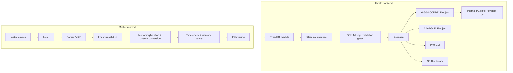
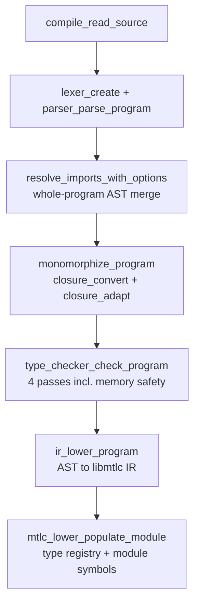

# The Mettle Toolchain, End to End

This is the single-document deep dive: how the Mettle language works, how the
frontend turns source into IR, and how the libmtlc backend turns IR into
running native and GPU code. It synthesizes and cross-links the per-topic docs
in `docs/` and `docs/libmtlc/`; where a topic has a dedicated reference, this
document explains the architecture and links there for the full contract.

Repository layout in one sentence: `src/lexer`, `src/parser`, `src/semantic`,
`src/frontend`, and `src/main.c` are the Mettle reference frontend;
`src/ir`, `src/codegen`, `src/linker`, `src/compiler`, `src/error`, and the
`mtlc_*.c` root TUs are libmtlc, the frontend-agnostic backend; `stdlib/` is
the standard library; `include/mtlc/` is the only header surface a foreign
frontend ever includes.

---

## 1. The big picture

The project is two products in one tree:

- **libmtlc** is a from-scratch, reusable native compiler backend: a custom
  typed IR, a classical fixpoint optimizer, a GNN-driven ML optimizer behind a
  translation-validation gate, hand-encoded code generation for four targets
  (x86-64 with AVX2, AArch64, NVIDIA PTX, SPIR-V), and its own PE linker on
  Windows. No LLVM, no VM, no external assembler, no assembly text anywhere in
  the pipeline. It ships as `bin/mtlc.lib` / `bin/libmtlc.a` behind
  `include/mtlc/`.
- **Mettle** is the reference frontend: a typed, assembly-inspired systems
  language whose driver (`bin/mettle`) lowers `.mettle` source into libmtlc IR
  and drives the backend end to end.



The boundary between the halves is architectural, not cosmetic. The backend
never includes a frontend header; the IR carries its own type descriptors and
module tables; and three test gates enforce it (section 12). Any frontend that
lowers into the IR, through the public builder in `mtlc/build.h` or through its
own lowering, gets the whole optimize/codegen/link pipeline.
`examples/calc/` is a complete second frontend in one file, and
`tests/public_api_test.c` drives the entire public surface against all four
targets.

---

## 2. The Mettle language

### 2.1 Identity and design goals

Mettle is a statically typed, manually managed systems language. Its stated
goals, in rough priority order:

1. **Compile speed is the flagship metric.** The whole pipeline is designed to
   stay fast at scale (roughly 200k LOC in about a second on the reference
   machine).
2. **Zero toolchain dependencies on Windows.** `mettle --build` goes from
   source to a runnable `.exe` using only the compiler binary: its own COFF
   emitter and its own PE linker, which resolves imports by DLL name so no
   Windows SDK import libraries are needed.
3. **Runtime: none.** A typical compiled program links libc and nothing else.
   There is no GC, no allocator state, no init/shutdown, no background
   threads. A handful of opt-in helper objects (crash handler, atomics,
   profiling, tracy stub) link only when their symbols are referenced.
4. **The language exercises the backend.** GPU kernels, SIMD contracts,
   tensor operations, and profiling exist in the language primarily because
   the backend supports them and needs a demanding consumer.

### 2.2 Syntax flavor

Hello world:

```mettle
import "std/io";

fn main() -> int32 {
  println("Hello, Mettle!");
  return 0;
}
```

Explicit types everywhere, generics via monomorphization, C-like control flow:

```mettle
struct Pair<A, B> { first: A; second: B; }

fn swap<T>(a: T*, b: T*) -> void {
  var tmp: T = *a; *a = *b; *b = tmp;
}

fn main() -> int32 {
  var p: Pair<int32, int32>;
  p.first = 10; p.second = 20;
  swap<int32>(&p.first, &p.second);
  return p.first + p.second;
}
```

A GPU kernel and its launch, showing the CUDA-shaped index built-ins and the
`dispatch` statement:

```mettle
kernel vadd(a: float32*, b: float32*, c: float32*, n: int32) {
  var i: int32 = block.x * block_dim.x + thread.x;
  if (i < n) { c[i] = a[i] + b[i]; }
}
```

```mettle
dispatch vadd[(n + 255) / 256, 256](da, db, dc, n);
```

Other distinctive surface features: `fn` and `function` are interchangeable;
`match` over tagged enums (statement and expression forms) plus a
constant-integer `switch` with range cases; range `for i in 0..n` and `0..=n`;
`defer` and `errdefer`; decorators `@simd`, `@inline`, `@noinline`, `@pure`,
`@noalloc`, `@test`, where the `!` variants (`@simd!`, `@inline!`) are hard
contracts the optimizer must satisfy or fail the compile.

### 2.3 Type system

Full reference: [types.md](types.md).

- **Primitives**: `int8/16/32/64`, `uint8/16/32/64`, `float32/float64`,
  `bool`. Integer literals default to `int32`, float literals to `float64`.
  Integer arithmetic wraps (two's complement, no traps).
- **Pointers** are C-style: `T*`, multi-level, full pointer arithmetic scaled
  by pointee size, `ptr[i]` sugar, `0` as null. Null-deref and array bounds
  checks are generated in normal builds and removed by `--release`.
- **`cstring`** is an alias for `uint8*`. **`string`** is a built-in 16-byte
  value struct `{ chars: pointer, length: uint64 }` that does not own its
  buffer.
- **Arrays** `T[N]` are fixed-size stack value types; pass `&arr[0]` as `T*`.
- **Structs** have C-matchable layout and can carry methods. **Enums** use an
  `int64` representation; **tagged enums** carry payloads (tag plus largest
  payload) and are consumed with `match`.
- **Function values**: thin `fn(T) -> R` pointers are C compatible;
  capital-F `Fn(T) -> R` is a stateful closure, an 8-byte pointer to a heap
  environment captured by value at creation and mutable across calls. Thin
  functions auto-adapt to `Fn` at literal boundaries.
- **Generics** on functions, structs, and tagged enums, with `trait` /
  `impl Trait for Type` bounds and `where` clauses. Everything monomorphizes
  before type checking; there are no runtime generics and no vtables.
- **Conversions**: widening is implicit, int-to-int and float-to-float
  narrowing is implicit, everything crossing int/float/pointer class needs an
  explicit `(Type)expr` cast.

### 2.4 Memory model and the borrow checker

Full references: [heap-allocation.md](heap-allocation.md),
[runtime-model.md](runtime-model.md), [borrow-checker.md](borrow-checker.md).

There is no heap manager. `new T`, heap-allocated array literals, and string
concatenation lower directly to libc `calloc`; freeing is manual via
`std/mem`. Locals, structs, and fixed arrays are stack value types.

The distinctive design piece is the borrow checker: **an advisory,
inference-only analysis with a zero-false-positive budget**. There is no
ownership syntax and no annotation; the checker never rejects a valid
program. It warns only when it can prove a bug on a function's straight-line
"spine": use-after-free (direct, via alias, or across a call), double free,
a borrow outliving its stack scope, interior pointers invalidated by
`realloc`/`free`, returning the address of a local, and leaks with no owner on
any path. Anything inside a branch or loop demotes to "maybe" and stays
silent. It checks raw pointers, which is exactly where Rust's checker goes
dark inside `unsafe`, but it is deliberately not a soundness guarantee: false
negatives are by design, and aliasing UB and data races are out of scope.
Implementation: `src/semantic/type_checker_memory.c` (about 2100 lines), a
two-phase analysis that infers per-function ownership summaries to a fixpoint
and then re-checks each function interprocedurally.

### 2.5 Modules and imports

Full references: [modules.md](modules.md), [imports.md](imports.md).

Compilation is whole-program: one entry file, imports resolved transitively
and merged into a single AST before anything else runs. Forms: plain
`import "std/io"`, namespaced `import "x" as m`, selective
`import { a, b } from "x"`, platform-conditional `import "std/net" if windows`,
and `import_str "file"` which embeds a file's bytes as a compile-time string.
`export` makes a module's public surface explicit; a module with no `export`
exposes everything for backward compatibility. Resolution order: absolute
path, `std/` under the stdlib root, `mettle.deps` package roots, relative to
the importer, `-I` directories, then the cwd. On Linux, a `.linux.mettle`
sibling of a stdlib module is preferred automatically.

### 2.6 C interop

Full reference: [c-interop.md](c-interop.md).

`extern fn name(...) -> T = "symbol";` declares a C function with an optional
link name. The ABI is MS x64 on Windows and System V AMD64 on Linux.
Mettle-calls-C struct-by-value follows the MS x64 aggregate rule (1/2/4/8-byte
structs in a register, everything else by hidden pointer); the System V
aggregate classifier is not implemented yet, so pointer parameters are the
safe choice on Linux. Because the internal PE linker probes common Win32 DLLs
directly (`kernel32`, `user32`, `gdi32`, `advapi32`, `ws2_32`, `ucrtbase`,
`msvcrt`), calling into Windows needs no import libraries at all.

### 2.7 The GPU model

Full references: [gpu.md](gpu.md), [gpu-architecture.md](gpu-architecture.md).

GPU support is explicit and two-stage, mirroring how persistent-VRAM GPU code
is actually written:

1. Kernels live in their own file, marked with the `kernel` keyword, and are
   compiled with `--emit-ptx` (NVIDIA PTX text) or `--emit-spirv` (SPIR-V
   binary for the OpenCL 2.0 environment). Only `kernel` declarations become
   GPU entry points; ordinary functions reachable from a kernel come along as
   device helpers.
2. The host program manages device memory itself (through `std/gpu`, thin
   CUDA Driver API bindings over `nvcuda`, no cudart and no nvcc) and launches
   with the `dispatch` statement, which survives lowering as a typed,
   target-neutral launch operation in IR.

Inside kernels: CUDA-shaped index built-ins (`thread.x`, `block.x`,
`block_dim.x`, `grid_dim.x`), `workgroup var` / `private var` address-space
storage, `barrier(...)` with explicit regions and memory order, asynchronous
global-to-workgroup staging (`async_copy_workgroup` / commit / wait, which
becomes `cp.async` on sm_80+), subgroup collectives (broadcast, shuffle,
ballot, reductions, scans), typed atomics with explicit order and scope, and
cooperative tensor operations (`tensor_mma`, `tensor_matmul`,
`tensor_epilogue`) covering the WMMA families, FP8/FP6/FP4 block-scaled
formats, and structured 2:4 sparsity. A shared device call-graph verifier
rejects recursion, indirect calls, external calls, and host launches from
device code, and performs scope-sensitive collective-uniformity analysis
before either GPU emitter runs. The default hardware profile is the DGX Spark
GB10 (PTX 8.8, `sm_121a`), with the local GPU auto-detected via `nvidia-smi`
when present.

### 2.8 The standard library

Full reference: [standard-library.md](standard-library.md).

`stdlib/std/*.mettle`, mostly thin typed bindings over libc and OS APIs, with
platform variants selected automatically (`*.linux.mettle`, `*_posix`).
Cross-platform: `std/io`, `std/mem`, `std/math`, `std/conv`, `std/process`,
`std/system`, `std/dir`, `std/bench`. Windows: `std/win32`, `std/ui` (a full
Win32 GUI framework), `std/net` (Winsock2), `std/thread`. POSIX variants:
`std/net_posix` / `std/net.linux`, `std/thread_posix`. Specialty: `std/gpu`
(CUDA Driver API), `std/tracy` (profiler bindings with a no-op stub when
built without `--tracy`), `std/http`, plus building blocks like
`arena.mettle`, `strbuf.mettle`, `alloc.mettle`. `std/prelude` re-exports the
core five and is opt-in via `--prelude`.

---

## 3. The frontend: source to IR

Everything in this section is Mettle-specific and lives outside the libmtlc
archive. Driver orchestration is in `src/main.c` (stage helpers around
main.c:2938-3035, the compile sequence around main.c:3260-3550).



### 3.1 Lexer and string interning

`src/lexer/lexer.c` (about 1200 lines) is a hand-written scanner. Keyword
classification is a direct `strcmp` chain over roughly 100 keywords.
Tokens carry line/column plus a `StringView { data, length }` into the source
buffer, so downstream code never re-scans for extents.

The global string interner also lives here (lexer.c:10-250, API in
`src/string_intern.h`). It maintains two parallel hash tables over shared
entries: a content-hash table (FNV-1a) for interning and a pointer-hash table
that powers `string_is_interned`, which lets `mettle_free_string` skip
interned pointers safely. Identifiers intern on first sight; single-character
operators borrow static storage from a `g_single_char_strings` table so
operator tokens allocate nothing. Interned pointers make name equality a
pointer compare throughout the semantic phase, which is one of the
compile-speed pillars.

### 3.2 Parser and AST

`src/parser/parser.c` (about 5200 lines) is recursive descent for
declarations and statements with precedence climbing for expressions
(`parser_parse_binary_expression(parser, min_precedence)` at parser.c:2509;
the precedence table at parser.c:418 runs from member access at 13 down to
`||` at 2).

The AST (`src/parser/ast.h`) is a uniform node: `ASTNode { type, location,
children, child_count, void *data, resolved_type }`, where `type` selects the
concrete payload struct behind `data` (about 40 node kinds). Nodes are
individually malloc'd, not arena-allocated. `resolved_type` caches the
semantic type after checking.

Error recovery is panic-mode: on error the parser synchronizes to the next
statement boundary (parser.c:364-378) and continues, accumulating up to 100
diagnostics per run in the `ErrorReporter` with stable codes (`E0001` lexical
through `E0007` internal) and scope-aware "did you mean" suggestions.

### 3.3 Import resolution

`src/semantic/import_resolver.c` (about 3900 lines) finds `AST_IMPORT` nodes,
lexes and parses each imported file with its own lexer/parser instance, and
merges the resulting declarations into the main AST. This is whole-program
merge, not separate compilation: after resolution there is one program.
The resolver canonicalizes paths to dedupe plain imports, detects and prints
circular import chains, rewrites non-exported helpers to internal names, and
applies namespace prefixes for `import ... as`.

### 3.4 Monomorphization and closures

`src/semantic/monomorphize.c` (about 3300 lines) runs before type checking:

1. Collect generic definitions and trait impl methods.
2. Collect instantiations reachable from non-generic code.
3. Worklist loop: generate concrete instantiations until fixpoint, so
   transitively generic code (a generic calling another generic) resolves.
4. `closure_convert_program` lifts anonymous `fn () {}` lambdas to top-level
   functions with synthesized environment records.
5. `closure_adapt_program` wraps thin function values into `Fn(...) -> R`
   closure adapters where the type demands it.

Because instantiation happens on the AST before checking, every concrete
instantiation is type-checked independently, and `--dump-mono` can write each
expansion out as source.

### 3.5 Type checking and memory safety

`src/semantic/type_checker.c` orchestrates four passes
(type_checker.c:230):

1. Register struct and enum types.
2. Register every function signature, enabling forward and mutual calls.
3. Check every declaration and function body (split across
   `type_checker_decl.c`, `type_checker_expr.c`, `type_checker_stmt.c`,
   `type_checker_types.c`, plus `match` exhaustiveness and definite
   initialization tracking).
4. Whole-program memory-safety analysis (`type_checker_memory.c`), the borrow
   checker described in section 2.4.

The symbol table (`src/semantic/symbol_table.c`) is a scope chain
(global / function / block) where each scope carries a lazily built
open-addressing name index so lookup is not a linear `strcmp` scan. Symbols
are tagged unions over variable/function/constant/constructor payloads and
carry declaration sites, usage flags for unused-variable warnings, extern
link names, and GPU address spaces.

### 3.6 The frontend/backend boundary

`src/frontend/` is the adapter that plugs the Mettle frontend into libmtlc,
and it is deliberately tiny:

- `mtlc_type_from_frontend.c` is the **single translation unit allowed to
  include both** the frontend `Type` and the backend `MtlcType`. It performs a
  structural one-to-one kind translation (the two enums intentionally share
  order), memoized per frontend type pointer, registering each node before
  recursing so self-referential types terminate.
- `mtlc_lower_module.c` populates the backend module's own type registry and
  symbol table from the frontend's checker state after IR lowering. Past this
  point, code generators never touch the AST, TypeChecker, or SymbolTable.

The actual AST-to-IR lowering (`src/ir/ir_lowering.c` plus `ir_lower_*.c`,
about 11.6k lines total) lives in `src/ir/` but is frontend-side: those TUs
are deliberately excluded from the libmtlc archive. `ir_lower_program`
(ir_lowering.c:34) is the entry; it calls `mtlc_lower_populate_module` at
ir_lowering.c:110, which is the moment the program becomes pure backend data.

---

## 4. The IR

Full contract: [libmtlc/ir.md](libmtlc/ir.md). Core implementation:
`src/ir/ir.c` / `ir.h`.

### 4.1 Design decisions

- **Not SSA.** A function body is a single flat array of fat
  `IRInstruction` records, not a pointer-linked graph. Values are
  single-assignment **temps** (`%name`) produced by value-producing
  instructions, and mutable **symbols** (`@name`) naming parameters, locals,
  and globals. There are no phi nodes; a value that must cross a branch merge
  lives in a local, and the optimizer plus register allocator recover
  registers from that shape. Passes reason about defs and uses by scanning
  the array with helper maps rather than via use-def chains.
- **The CFG is a derived view.** `IRBasicBlock` records point into the
  instruction array with successor/predecessor index lists; a `cfg_valid`
  flag marks staleness, and `ir_function_rebuild_cfg` (ir.c:1148)
  reconstructs it from labels and terminators. Most passes mutate the flat
  array and rebuild at the end.
- **Types ride on instructions.** Every instruction carries its baked result
  type (`value_type`, an `MtlcType *`), plus flags the encoders need
  (float, width, signedness). The backend never re-infers a type from
  context, which makes a wrong result type from a frontend a silent
  miscompile rather than an error; the docs are explicit about this contract.
- **About 130 opcodes**, in two bands: the ordinary core (assign, load,
  store, binary, unary, call, branch-if-zero, jump, label, return, cast,
  address-of) and a large family of **recognized idiom super-ops** planted by
  the optimizer (`IR_OP_SIMD_SUM_I32`, `IR_OP_SIMD_VLOOP_F64`,
  `IR_OP_SELECT`, `IR_OP_COUNT_WORD_STARTS`, tensor and GPU operations, and
  many more). Each idiom opcode's exact scalar semantics are documented
  inline in `ir.h`, and the reference interpreter implements them, which is
  what makes translation validation possible.
- **GPU semantics are first-class IR**, not strings: `MtlcIntrinsic`
  identities for index/subgroup/math/atomic operations, explicit
  `MtlcAddressSpace` on pointer types, explicit memory order and scope on
  atomic instructions, balanced async-copy groups checked by a dataflow
  verifier, and descriptor-exact tensor operations (`IR_OP_TENSOR_MMA`,
  `IR_OP_TENSOR_MATMUL`, `IR_OP_TENSOR_EPILOGUE`, `IR_OP_TENSOR_TRANSFER`)
  that carry complete logical contracts while keeping warp fragments and
  vendor instruction grids out of shared IR.

### 4.2 Semantics highlights

The details are in [libmtlc/ir.md](libmtlc/ir.md); the ones that shape
everything else:

- Comparisons produce 0/1 integers; `&&` and `||` in IR are bitwise, and
  frontends lower short-circuit evaluation with branches.
- Integer overflow wraps; division by zero is whatever the target does; the
  backend inserts no checks, and a frontend that promises checks emits them
  as IR (this is exactly what Mettle's null/bounds lowering does, and what
  `--release` turns off).
- Narrow loads extend by element signedness, which is why loads carry the
  element type rather than a byte count.
- Pointers are integers with a type; pointer arithmetic is integer
  arithmetic.
- `branch_if_zero` is the only conditional; every path must end at a return.

### 4.3 Module tables and the type system

A module carries a **type registry** (name to `MtlcType *`; the IR references
types by canonical parseable names like `"int64*"` or `"global:float32*"`)
and a **module symbol table** (one entry per function and global with kind,
signature, extern flag, link name, and folded initializers). Calls resolve by
name against this table at emit time.

`MtlcType` (`include/mtlc/type.h`, full reference
[libmtlc/types.md](libmtlc/types.md)) is a plain value struct: kind, layout,
and composition pointers, with no methods and no hierarchy. Two contracts
matter everywhere:

- **Immortality**: everything that accepts a `const MtlcType *` borrows it,
  and the registry never frees. Canonical scalar descriptors are static
  singletons; pointer descriptors intern by (base, address space) in a
  thread-local cache and live for the process.
- **Signedness drives selection**: signed versus unsigned division,
  comparison, right shift, and load extension all come from the type kind,
  via the same predicates (`mtlc_type_is_unsigned` and friends) the code
  generators call.

---

## 5. The classical optimizer

Full reference: [libmtlc/pipeline.md](libmtlc/pipeline.md). Implementation:
`src/ir/ir_optimize*.c` and `src/ir/optimizer/` (about 35 pass files;
`optimizer/README.md` is the module map).

### 5.1 Schedule

`ir_optimize_program_pipeline` (`ir_optimize_pipeline.c`) runs, in order:

1. **Program-level pre-passes**: fold never-written global integers to
   constants; a pre-inline canonicalization stage (pointer induction and the
   early idiom recognizers) so the inliner sees canonical forms; tail
   recursion to loops; small-function inlining driven by a function index
   with PGO-widened budgets; bounded self-recursion inlining; `@pure`
   loop-invariant call hoisting; and, under `whole_program`, allocation-site
   layout factorization (sound only when every call site is visible and
   `main` is the single entry).
2. **Per-function fixpoint stage**: up to 8 iterations over roughly 35
   feature-gated passes: copy and constant propagation, constant folding and
   branch simplification, CSE, SROA, dead-temp elimination, jump threading
   and unreachable-block cleanup, constant-size memcpy inlining, rotate
   fusion, small-loop and reduction unrolling, plus in-fixpoint SIMD
   recognizers (integer sums, dots, byte maps, insertion sort).
3. **Post-fixpoint idiom stage**, run once in a deliberate order: the heavy
   vectorizers (fills, prefix sums, min/max scans, affine float maps, exp and
   silu kernels, dot products, the general `@simd` map/reduce
   auto-vectorizer, outer-loop vectorization, memory maps, lower-bound and
   shift-loop recognizers), congruent induction-variable elimination,
   if-conversion to branchless `IR_OP_SELECT`, and finally software prefetch
   for indirect loads.
4. **Contract enforcement**: `@inline!`, `@simd!`, and `@noalloc` are
   verified; a violated contract fails the compile with a diagnosis rather
   than silently degrading.

The recognizers rewrite loops into the dedicated idiom opcodes of section
4.1; only the x86-64 backend implements those opcodes, which is why the
**target-neutral schedule** (used for ARM64, PTX, and SPIR-V via
`mtlc_optimize_for`) restricts itself to shared scalar and control-flow
rewrites plus the semantic GPU transforms (async staging promotion and tensor
accumulator-chain / residency formation). For PTX and SPIR-V, only
kernel-reachable device functions are transformed, after shared call-graph
and collective-uniformity validation.

### 5.2 Pass driver mechanics

`ir_run_fixpoint_pass` (`ir_optimize_pass_driver.c:296`) gives every function
a monotonic IR version; each pass records the version at which it last
reported clean and is skipped while nothing changed underneath it. Every pass
that reports a change is wrapped by the translation-validation snapshot
machinery (section 7) when `--verify` is active. Debug knobs:
`METTLE_SKIP_PASS=<names>` (bisect a miscompile to one pass),
`METTLE_TRACE_IR_PASSES`, `METTLE_TIME_IR_PASSES`, `METTLE_NO_SIMD`.

### 5.3 Hotness and PGO

Two profile sources feed one hotness policy (`ir_optimize_hotness.c`):

- **Zero-run PGO** (`ir_pgo.c`, `--pgo`): the compiler interprets the
  program's own `main` in the reference interpreter right after lowering,
  deterministically and fuel-capped, harvesting call counts, body step
  counts, and source-location-keyed site counts (keyed by location so the
  data survives inlining and rewrites). No instrumented run, no separate
  profile step.
- **Measured runtime profiles** (`--profile-runtime`, `ir_profile.c`): entry
  and exit hooks on every compiled function feed a JSON profile
  (`mettle.mprof`) with a call graph and per-op counts, printed as a sorted
  report at process exit.

Hot callees get widened inline budgets, hot loops get higher unroll caps
(16 cold / 64 default / 128 hot), cold sites skip prefetch, and PGO reorders
function emission for instruction-cache locality.

---

## 6. The ML optimizer

Full reference: [ml-opt.md](ml-opt.md). Implementation: `src/ir/ml_gnn.c`
(native C GNN inference) and `src/ir/ml_opt.c` (application and gate).

The design rule is **the model proposes, the validator disposes**:

1. After the classical pipeline, the IR is dumped (`_mlopt.ir`) and
   `ml_gnn_run` builds a typed-edge dataflow graph over it (def-use, control,
   same-expression, and dominating-same-expression edges) and runs a
   relational GNN forward pass in plain C. No Python exists at compile time.
   The shipped model is about 10.8M parameters (hidden dim 384, 8 layers,
   `gnn_genius.bin`), plus bitwise and GF(2) superoptimizer tables.
2. The model emits per-instruction dispositions (`_mlopt.disp`): delete,
   copy-forward, constant-fold, or an RPN rewrite expression.
3. Each disposition group is applied to a snapshot of the function, then the
   pre- and post-rewrite IR are both executed in the reference interpreter on
   identical generated inputs, comparing every observable. A divergence rolls
   the group back and bisects to name and reject exactly the offending
   disposition, printing a runnable counterexample.
4. Sound-by-construction transform classes (GVN, affine, collapse,
   superopt-table rewrites) are proven at construction and re-checked anyway;
   speculative deletion applies only under `--ml-opt-speculative` and stands
   purely on the validator's word. `METTLE_ML_SABOTAGE` deliberately injects
   a wrong disposition to prove the gate catches it.

Default builds ship no model, in which case the pass proposes nothing and
succeeds. The model is never trusted, only checked. `--ml-opt` is rejected on
portable targets until the proposal/validator surface has an equally explicit
target-neutral contract.

---

## 7. Verification: how the compiler checks itself

Three independent mechanisms, all built on the same reference interpreter
(`src/ir/ir_interp.c`, about 2700 lines, which executes IR directly and
implements every idiom opcode's documented scalar semantics):

- **Translation validation** (`--verify`, `src/ir/ir_verify.c`): every pass,
  on every function it changed, is validated by executing before-IR and
  after-IR on six generated input sets and comparing return values, final
  buffer bytes, the ordered extern-call trace including pointed-to bytes, and
  touched globals. Uninitialized locals read deterministic 0xA5 poison so a
  deleted initializing store cannot hide. A divergence names the pass and
  function, prints a counterexample, restores the pre-pass IR, quarantines
  that pass/function pair, and recompiles; the shipped binary is always built
  from validated IR.
- **The differential fuzzer** (`tools/fuzz/`): generated UB-free programs
  compiled at `-O0` and `--release`, failing on any behavioral divergence.
  Every codegen or optimizer change runs it.
- **Suite gates** (`tests/run_tests.ps1`): `public_api` (builder to all four
  targets with native runs asserted), `calc_frontend` (a real second
  frontend against the archive alone), `ptx_emit_*` / `spirv_emit_*`
  (round-trips through `ptxas` and `spirv-val` when installed), and
  `libmtlc_selfcontained` (the symbol-closure audit of section 11).

The same interpreter also powers zero-run PGO and the `mettle test` / `trace`
compile-time execution workflows (`ir_comptime.c`), so the semantics it
implements are exercised constantly, not only when verifying.

---

## 8. Code generation

Implementation: `src/codegen/`, with the x86-64 core in `src/codegen/binary/`
(about 52k lines). Per-target reference:
[libmtlc/pipeline.md](libmtlc/pipeline.md#the-code-generators).

### 8.1 x86-64, the primary path

`code_generator_generate_program` walks the module: functions from the IR
program list, globals and externs from the module symbol table. Machine code
is hand-encoded; there is no assembler and no text stage anywhere.

Each function takes one of two paths, chosen in `binary/driver.c`:

- **The MIR path** (preferred, gated by `mir_function_is_eligible`): IR
  lowers to a machine IR over virtual registers (`mir_lower.c`, about 5300
  lines), gets register-allocated, and encodes to bytes (`mir_encode.c`).
  Two allocators share the liveness machinery (`mir_regalloc.c`): a classic
  linear scan that spills the longest remaining interval, and a
  graph-coloring allocator with a dynamic spill-cost model (use density
  weighted by loop depth) and coalescing via two-address hints. The
  allocatable GP pool is deliberately the callee-saved set (RBX, R12-R15,
  with R10/R11 reclaimable); RAX/RCX/RDX stay encoder scratch and argument
  registers are excluded to avoid parallel-move hazards.
- **The baseline generator** (fallback, `emit.c`, about 6000 lines): a
  stack-slot generator fronted by a long ordered cascade of idiom pattern
  emitters. This is also where the SIMD super-ops the optimizer planted
  become AVX2 sequences (`simd_float.c`, `simd_int.c`, `simd_encoders.c`).

A peephole pass (`peephole.c`, about 2900 lines) cleans up emitted code.
Both ABIs are supported and pinned to the object format: COFF implies MS x64,
ELF implies System V (`code_generator_binary_select_abi`). Output accumulates
in the format-neutral `binary_emitter` section/symbol/relocation model and
serializes as COFF (`binary_emitter.c`) or ELF64 (`elf_emitter.c`).
`--explain` and `--annotate-asm` observe codegen decisions through
thread-local capture sinks.

### 8.2 AArch64

`arm64_ir_encode.c` writes an ELF64 relocatable object (`EM_AARCH64`) with
AAPCS64 calls (independent x0-x7 and v0-v7 banks, 8-byte overflow stack
slots) and AAELF64 relocations. The lowering is deliberately simple and
non-optimizing: values home to stack slots around scalar integer, control
flow, and direct-call operations. Floats, aggregates, `address_of`, and the
SIMD idiom opcodes are not part of the AArch64 surface yet. The explicit
`--emit-arm64` flag keeps an older self-contained `_start` smoke-executable
path for assembler-free bring-up; normal AArch64 builds use the relocatable
object plus the system `gcc -no-pie` link.

### 8.3 NVIDIA PTX

`ptx_emitter.c` (about 7600 lines, the largest single emitter) writes a PTX
text module: one `.visible .entry` per `kernel`, reachable helpers as
non-entry `.func` definitions, host functions omitted. PTX has unlimited
typed virtual registers, so there is no register allocation; every IR value
maps to a fresh register of its class. The emitter consumes semantic
intrinsic identities and lowers them to special registers, `shfl.sync`
subgroup collectives over the active mask, `bar.sync` barriers, `cp.async`
staging groups on sm_80+, and the WMMA / mma.sp / block-scaled tensor
families for `IR_OP_TENSOR_MMA` and `IR_OP_TENSOR_MATMUL`, subdividing
logical tiles into stable WMMA grids while keeping that physical plan
entirely backend-owned. Default profile is GB10 (PTX 8.8, `sm_121a`),
overridable per context. The suite round-trips emitted PTX through `ptxas`
when CUDA is installed.

### 8.4 SPIR-V

`spirv_emitter.c` writes a binary module for the OpenCL 2.0 execution
environment: Physical64 addressing, the Kernel capability, one
`OpEntryPoint Kernel` per kernel. Kernel pointer parameters are
CrossWorkgroup pointers converted through 64-bit integers for arithmetic,
mirroring how the IR carries addresses; values live in Function-storage
variables with no OpPhi (the consuming driver promotes them); control flow
maps directly onto SPIR-V blocks, which the Kernel model permits. The same
semantic intrinsics map to OpenCL built-ins and Groups operations. The
current profile honestly rejects what it cannot express: variable-source
shuffle, tensor MMA, and tensor epilogues are capability errors rather than
silent approximations. Emitted modules pass `spirv-val` and survive
`spirv-opt -O` round trips.

### 8.5 Debug info

DWARF 4 is the emitted format on both platforms (`-g` embeds `.debug_info`,
`.debug_abbrev`, `.debug_line`, `.debug_str`, `.debug_frame` in ELF or COFF
objects for GDB/LLDB); there is no CodeView/PDB path. Register-allocated
locals get `DW_OP_regN` location expressions, stack-homed ones `DW_OP_fbreg`.
Separately, `-s` embeds compact runtime crash-trace tables
(`mettle_debug_functions` / `mettle_debug_locations`) that the crash handler
uses for symbolized backtraces without any DWARF present.

---

## 9. Linking

Implementation: `src/linker/`. Reference:
[libmtlc/pipeline.md](libmtlc/pipeline.md#linking),
[linker-build-pipelines.md](linker-build-pipelines.md).

**Windows: the internal PE linker.** `mtlc_build_executable` and the
driver's `--build`:

1. A startup object is generated in memory (`binary/startup.c`), exporting
   `mainCRTStartup`: it initializes CRT arguments via `__getmainargs` when
   `main` wants argc/argv, calls `main`, and exits with its result. With
   `-s` it also calls `mettle_crash_startup` first.
2. `link_resolution_build` (`symbol_resolve.c:91`) parses the COFF objects
   (`coff_reader.c`), merges sections, and resolves symbols through an
   open-addressing hashed name index.
3. `pe_emit_executable` (`pe_emitter.c`) writes the PE32+ image, building the
   import table **by DLL name**: any still-undefined symbol that a probed DLL
   exports becomes an import. The library entry point probes
   `kernel32/ucrtbase/msvcrt`; the Mettle driver widens the set
   (`user32`, `gdi32`, `advapi32`, `ws2_32`, ...) and accepts
   `--link-arg` additions, including `.lib` import libraries
   (`import_lib.c`) and extra COFF objects.

This is why a Mettle program calling `printf` or `CreateWindowExA` builds on
a machine with no Visual Studio, no Windows SDK, and no MinGW. There is no
incremental linking; every build is a full resolve and emit, which the
compile-speed budget absorbs.

**ELF hosts.** There is no internal ELF linker: the object links with the
system toolchain (`gcc -no-pie` by default, a direct `ld` fast path,
`--static` and `--musl` variants), which supplies crt startup and libc. The
same contract covers x86-64 and AArch64 Linux.

---

## 10. The runtime model

There is almost nothing to describe, which is the point. A compiled program's
entry is the emitted startup object; there is no runtime initialization, and
a typical program links libc only. Four opt-in helper objects
(`src/runtime/`) link only when the generated object references their
symbols:

- `crash_handler.o`: installed by `-d`/`-s`/`-g` builds; a Windows SEH
  filter or a POSIX `sigaction` handler on an alternate signal stack (so
  stack-overflow SIGSEGV still reports), printing symbolized backtraces from
  the embedded runtime tables. IR null/bounds traps route here when `-s` is
  active.
- `atomics.o`: interlocked atomics for `std/thread`.
- `profile.o`: the `--profile-runtime` collection and report runtime.
- `tracy_helpers.o`: no-op stubs so `std/tracy` importers build identically
  with and without `--tracy`.

Crash handling, profiling, and debug tables are the only pieces of "runtime"
that exist, and all of them are failure-path or opt-in.

---

## 11. libmtlc as a library

Full references: [libmtlc/api.md](libmtlc/api.md),
[embedding.md](embedding.md), [libmtlc/internals.md](libmtlc/internals.md).

### 11.1 The public surface

`include/mtlc/` plus the archive is the entire dependency. The API splits
into:

- **The builder** (`mtlc/build.h`, implemented in `mtlc_build.c`): a
  programmatic frontend. `mtlc_builder_create`, `mtlc_builder_function`,
  the instruction constructors (`mtlc_binary`, `mtlc_call`, `mtlc_load`,
  `mtlc_label`, ... through the GPU and tensor operations), and
  `mtlc_builder_finish`, which populates the module type registry and symbol
  table so a frontend never fills them by hand.
- **The pipeline** (`mtlc/pipeline.h`, implemented in `mtlc_api.c`):
  `mtlc_context_create` and its knobs (opt level, whole-program, explain,
  PTX target, tensor tuple budget), `mtlc_optimize` / `mtlc_optimize_for`,
  `mtlc_apply_ml_opt`, `mtlc_emit_object`, `mtlc_emit(ctx, module, arch,
  path)` reaching all four targets, and `mtlc_build_executable` which goes
  all the way to a runnable binary with no external toolchain on Windows.

A frontend that already has its own lowering can instead adopt a raw
`IRProgram` via `mtlc_module_adopt_ir`. The reference Mettle frontend
predates the public builder and lowers through its own adapter; nothing it
does is available to it that is not available to an external frontend.

### 11.2 How the archive stays frontend-agnostic

Three enforced mechanisms (details in
[libmtlc/internals.md](libmtlc/internals.md)):

1. **No frontend includes.** No TU in the archive includes a
   parser/semantic/AST header; the diagnostics renderer needs only the
   dependency-free `source_location.h`. The Mettle lowering TUs live in
   `src/ir/` but are deliberately excluded from the archive.
2. **The fallback member.** `mtlc_lib_fallbacks.c` provides strong default
   definitions for the two symbols the reference driver normally supplies
   (the lexer's `string_is_interned` and the crash reporter's exception
   namer), relying on archive-extraction semantics so the driver's own
   definitions win when present.
3. **The audit gate.** `libmtlc_selfcontained` computes the archive's
   undefined-minus-defined symbol closure with `nm` and fails if anything
   project-shaped remains; only libc, kernel32-level imports, and compiler
   intrinsics are allowed.

### 11.3 Ownership and threading rules

The rules that make two frontends able to compile concurrently on separate
threads: appended instructions deep-clone their operands (builders construct
on the stack and discard); type descriptors are borrowed forever and never
freed; and every piece of per-compile mutable state in the archive is
thread-local (compiler session context via FLS/pthread keys, the
explain/annotate sinks and the pointer-type intern cache via
`MTLC_THREAD_LOCAL`). A mutable file-scope variable in the archive that is
not thread-local is, by rule, a bug.

---

## 12. The driver, end to end

`src/main.c` (about 4200 lines) is the reference CLI. The full sequence for
`mettle --build -O app.mettle -o app.exe` on Windows:

1. Read source; lex and parse (`parser_parse_program`).
2. Resolve imports into one AST (`resolve_imports_with_options`).
3. Monomorphize, closure-convert, closure-adapt.
4. Type check, including the memory-safety pass; drop `@test` functions.
5. Lower to IR (`ir_lower_program`), populating the backend module tables.
6. Optional zero-run PGO interpretation of `main`.
7. Optimize (`ir_optimize_program`), then optionally `ir_apply_ml_opt`.
8. Lower GPU launches to the host ABI; apply `--native-heap` routing and
   profile instrumentation (after optimization, so hooks match shipped
   block structure).
9. Hand the IR to codegen (`code_generator_set_ir_program` is the sole data
   handoff) and emit the COFF object.
10. Generate the startup object, run the internal PE linker, write the
    executable.

Compilation is single-threaded end to end; the compile-speed target is met by
algorithmic care (interning, indexed scopes, version-skipped passes, derived
CFGs) rather than parallelism. Every stage is wrapped in phase timing, and an
internal compiler error produces a structured ICE report (phase, pass,
function, IR instruction, last tracked action, native backtrace) via
`src/compiler/compiler_crash.c`.

Introspection flags at every stage: `--dump-ast`, `--dump-mono`,
`--dump-ir[=before,after]`, `--dump-ir-passes`, `--explain` (per-loop
vectorization and per-call inlining decisions with reasons and fixes),
`--simd-report`, `--annotate-asm`, `--verify`, `--debug-compiler`. See
[compilation.md](compilation.md) for the full option reference.

---

## 13. Honest limitations

The per-topic list lives in [known-limitations.md](known-limitations.md);
the architecturally significant ones:

- The borrow checker is advisory and intra-function; it proves the presence
  of a bug subset, never absence. `--release` removes generated null/bounds
  checks entirely.
- x86-64 is the only target implementing the full IR surface. AArch64 has no
  floats, aggregates, or SIMD; the SPIR-V profile rejects tensor MMA and
  epilogues; `--ml-opt` is x86-64 only.
- Global `const` is integer-only; several thin-`fn` to `Fn` adaptation gaps
  exist; closure environments are never freed.
- C-calls-Mettle struct-by-value is untested, and the System V aggregate
  classifier is not implemented.
- Whole-program compilation means no separate or incremental compilation
  units, and the internal linker is full-relink each build; compile speed is
  the mitigation for both.
- SPIR-V host execution is not yet execution-tested; GB10 hardware
  qualification for the newest tensor paths is pending.

---

## 14. Where to go deeper

| Topic | Document |
|---|---|
| Language reference | [LANGUAGE.md](LANGUAGE.md), [quick-reference.md](quick-reference.md) |
| Types, memory, borrow checker | [types.md](types.md), [heap-allocation.md](heap-allocation.md), [borrow-checker.md](borrow-checker.md), [runtime-model.md](runtime-model.md) |
| Modules and interop | [modules.md](modules.md), [imports.md](imports.md), [c-interop.md](c-interop.md) |
| Driver and builds | [compilation.md](compilation.md), [linker-build-pipelines.md](linker-build-pipelines.md) |
| GPU | [gpu.md](gpu.md), [gpu-architecture.md](gpu-architecture.md) |
| Backend contract | [libmtlc/README.md](libmtlc/README.md), [libmtlc/api.md](libmtlc/api.md), [libmtlc/ir.md](libmtlc/ir.md), [libmtlc/types.md](libmtlc/types.md) |
| Backend internals | [libmtlc/pipeline.md](libmtlc/pipeline.md), [libmtlc/internals.md](libmtlc/internals.md), `src/ir/optimizer/README.md` |
| Optimizer verification | [translation-validation.md](translation-validation.md), [ml-opt.md](ml-opt.md), [pgo.md](pgo.md) |
| Embedding a frontend | [embedding.md](embedding.md), `examples/calc/` |
| Testing | [testing.md](testing.md), [diagnostics.md](diagnostics.md) |
