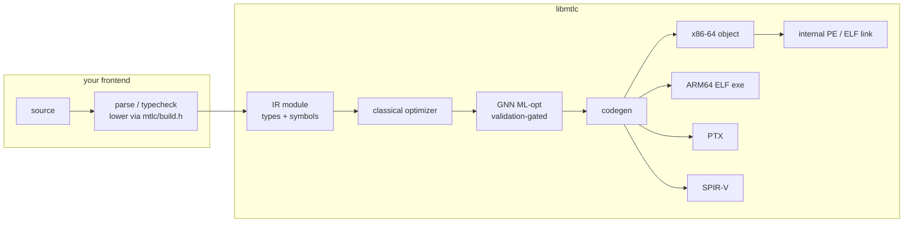

# libmtlc reference

libmtlc is a standalone, frontend-agnostic native compiler backend: a custom IR,
a classical optimizer plus a GNN-driven optimizer behind a translation-validation
gate, hand-encoded code generation for four targets (x86-64 with AVX2, AArch64,
NVIDIA PTX, SPIR-V), and its own PE linker on Windows. A frontend links
`bin/mtlc.lib` (Windows) or `bin/libmtlc.a` (Linux), includes only
[`include/mtlc/`](../../include/mtlc/), and drives the whole path from IR to a
running binary.

This directory is the backend reference. Read it in this order the first time:

| Document | What it covers |
|---|---|
| [Getting started](../embedding.md) | The tutorial: build IR, optimize, emit, link, with a complete non-Mettle example. |
| [API reference](api.md) | Every public function and type in `include/mtlc/`, with ownership, lifetime, error, and thread-safety contracts. |
| [The IR model](ir.md) | Values, storage, instructions, control flow, module tables, and the IR shape each consumer requires. |
| [The type system](types.md) | `MtlcType` in full: kinds, layout, canonical constructors, and the immortality contract. |
| [The pipeline](pipeline.md) | What the optimizer actually does, the ML-opt validation gate, each code generator's product and limits, and how linking works. |
| [Internals](internals.md) | Source layout, how the library is assembled, the invariants that keep it frontend-agnostic, and the test gates that enforce them. |

Two consumers ship in this repository and double as living documentation:

- [`examples/calc`](../../examples/calc/): a complete non-Mettle frontend in one
  file (tiny C-like language to native executable).
- [`tests/public_api_test.c`](../../tests/public_api_test.c): exercises the full
  public surface against all four targets; runs in the suite as the
  `public_api` gate.

The Mettle reference frontend (`src/lexer`, `src/parser`, `src/semantic`,
`src/main.c`) is a third consumer. It predates the public builder and lowers
through its own adapter (`src/frontend/`); nothing it does is available to it
that is not available to you.

Version: the API reports itself via `mtlc_version()` (currently
`"libmtlc 0.1.0"`). Until 1.0, additions are expected and signatures may still
move; the headers are the source of truth.
