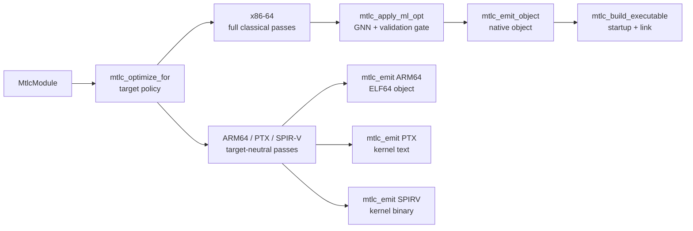

# The libmtlc pipeline

What actually happens between `mtlc_builder_finish` and a running binary. The
stages are independent library calls (see the [API reference](api.md#pipelineh));
this document is what each one does inside.

Every emitter accepts unoptimized IR. `mtlc_optimize_for` is the safe optimized
path: x86-64 gets the full pipeline, ARM64 gets scalar target-neutral passes,
and PTX/SPIR-V get those passes only over kernel-reachable device functions.
The generic `mtlc_optimize` conservatively selects the device policy whenever a
module contains kernels; callers that know the consumer should name it.

Semantic host launches are the exception to ordinary call IR. Before any host
optimizer or emitter, `ir_program_lower_gpu_launches` materializes each kernel
argument in a cell of its exact declared type, builds the provider parameter
array, and lowers the operation to the checked `mtlc_gpu_launch_checked` ABI.
PTX and SPIR-V do not run this pass: they consume device kernel entries and do
not emit host-launch functions. This keeps frontend launch semantics and GPU
backend/runtime-provider conventions separate.

## The classical optimizer

For x86-64, `mtlc_optimize_for` runs a fixpoint pass pipeline over every
function, with pre-inline and post-fixpoint phases around it. The pass families,
by the modules that implement them (`src/ir/optimizer/`):

- **Foundation**: common-subexpression elimination, dead-temp removal,
  constant/copy propagation, constant folding, branch simplification and dead
  branch cleanup, rotate fusion, small-function inlining (driven by a function
  index built up front).
- **Loop recognizers**: counted-loop parsing feeding small-loop unrolling and
  reduction unrolling; loop-invariant null-check hoisting; word-count and
  div-by-power-of-two idioms; popcount and Collatz step loops; min/max,
  prefix-sum, lower-bound, dot-product, and memcmp scans.
- **SIMD lowering** (x86-64 AVX2): integer and float horizontal sums, dot
  products, affine maps, fills, clamps, scale/reverse memory maps, byte-map
  chains, insertion-sort and shift-loop kernels, and the general `@simd`
  vectorizer for map/reduce loops. These rewrite loops into dedicated IR
  opcodes that only the x86-64 backend implements, so they are excluded from
  the target-neutral schedule.
- **Memory**: scalar replacement of aggregate locals (SROA), memcpy
  constant-size lowering, load-to-copy cleanup, congruent
  induction-variable elimination.
- **Hotness policy**: a zero-run PGO estimate (or measured frequencies when
  the driver ran `--pgo`) sets code-size versus speed thresholds per site.

Knobs read from the context:

- `opt_level <= 0`: skip everything (successful no-op).
- `whole_program`: enables transforms that are only sound when every call site
  is visible and `main` is the single entry point (for example allocation-site
  layout factorization, which rewrites callee bodies). Set it if and only if
  the module becomes a whole executable.
- `explain` / `explain_focus_file`: emit a remark for each vectorization and
  inlining decision, including the reason when a rewrite was declined.

Contracts: IR may carry optimization contracts (the Mettle frontend spells
them `@simd!`, `@inline!`, `@noalloc`). A violated contract makes
`mtlc_optimize` return 0 after reporting.

### Target-neutral schedule

`mtlc_optimize_for(..., MTLC_ARCH_ARM64/PTX/SPIRV)` runs only shared scalar and
control-flow rewrites: copy/constant propagation, CSE, algebraic and branch
simplification, dead temporary removal, unreachable-block/straight-line
elimination, label/jump threading and cleanup, load-copy elimination, exact
adjacent tensor-accumulator chain formation, and exact single-update runtime
loop residency formation. It also promotes a proved typed
global-load/workgroup-store sequence into balanced neutral asynchronous staging
and recognizes a finite wait/barrier-separated sequence of connected MMAs. These passes
are semantic and target-neutral: staging proves address provenance, alignment,
single use, straight-line effects, and ordered publication; tensor residency
requires identical descriptors, one connected D, compatible C/D strides, and
no intervening observable operation. For a loop it additionally requires a
single entry/backedge and a register-only body, then splits only the loop-exit
edge through a neutral commit. For a pipeline it requires one basic block and
an exact wait-then-workgroup-barrier handoff before every connected update. Shared
GPU verification rebuilds the CFG and rechecks the scope-specific shape. The
pass does not form SIMD opcodes, fuse x86 rotates,
introduce host memory intrinsics or prefetch, or make a target-specific
selection; PTX applies its own inspectable tuple-pressure budget after receiving
the neutral chain or residency group.

For PTX/SPIR-V the shared GPU call graph is validated first and only transitively
kernel-reachable functions are transformed. Barriers, scoped atomics, subgroup
collectives, tensor descriptors, address spaces, and kernel identity remain
semantic IR operations throughout. The Mettle CLI uses this schedule for
`-O --emit-ptx` and `-O --emit-spirv`; `--ml-opt` is rejected on portable targets
until its proposal/validator surface has an equally explicit neutral contract.

Debugging a pass: the environment variable `METTLE_SKIP_PASS=<name,name>`
skips named fixpoint passes, which together with the differential fuzzer
bisects miscompiles to a single pass.

## The ML optimizer

`mtlc_apply_ml_opt` is a learned pass behind a hard validation gate: **the
model proposes, the validator disposes**.

1. A graph neural network (native C inference; no Python at compile time)
   scores spots where a cheaper equivalent form likely exists.
2. A sound transform realizes each proposal on a copy of the function IR.
3. The pre-rewrite and post-rewrite IR are both executed in the reference
   interpreter on identical generated inputs; every observable is compared.
4. Divergence rejects the proposal with a printed counterexample; the function
   keeps its validated IR.

`MtlcMlOptStats` reports proposals / validated / proven / rejected / skipped.
Default builds ship no model, in which case the pass proposes nothing and
returns success. The model is never trusted, only checked.

## The code generators

### x86-64 (the primary path)

`mtlc_emit_object` / `mtlc_emit(MTLC_ARCH_X86_64)` produce a relocatable object
in the host container (COFF on Windows, ELF elsewhere) with hand-encoded
machine code; there is no assembler and no text stage. Functions go through a
register-allocating MIR backend when eligible, with a baseline stack-slot
generator as the fallback, and the SIMD opcodes the optimizer planted become
AVX2 sequences. Globals, string literals, and jump tables are laid out in the
object's data sections with relocations; externs become undefined symbols for
the linker. This is the only target implementing the full IR surface.

### AArch64

`mtlc_emit(MTLC_ARCH_ARM64)` writes an **ELF64 relocatable object** with
`EM_AARCH64`, normal function/global symbols, `.text/.rodata/.data/.bss`, and
AAELF64 `CALL26`, page-address, low-12, and absolute-data relocations. Calls use
AAPCS64's independent `x0..x7` and `v0..v7` banks plus 8-byte overflow stack
slots; incoming stack parameters use the matching layout. This is specifically
covered by an eleven-argument CUDA launch ABI gate.

The lowering model remains deliberately simple and non-optimizing: values are
homed to stack slots around scalar integer, pointer, load/store, address-of,
float, control-flow, and direct-call operations. Aggregates and optimized SIMD
IR are not yet an AArch64 surface. The driver's explicit `--emit-arm64` option
retains the older self-contained `_start` smoke executable for assembler-free
bring-up; ordinary AArch64 Linux object/build commands use the relocatable path.

### NVIDIA PTX

`mtlc_emit(MTLC_ARCH_PTX)` writes a PTX text module. A new context defaults to
the DGX Spark GB10 profile (`.version 8.8`, `.target sm_121a`); embedding
frontends can select another backend profile with
`mtlc_context_set_ptx_target`.
**Every function marked as a kernel becomes a GPU entry point** (`.visible
.entry`). Ordinary functions reached by a kernel become non-entry `.func`
definitions; unrelated host functions are omitted. Parameters are scalars and
raw device pointers. PTX has unlimited typed virtual
registers, so there is no register allocation; each IR value maps to a fresh
register of its class.

The emitter consumes semantic `MtlcIntrinsic` identities, not source-level
function names. The reference Mettle frontend maps native index/member syntax
and compatible legacy aliases while lowering; another frontend can call
`mtlc_intrinsic` directly:

| Intrinsic family (legacy Mettle aliases) | Meaning |
|---|---|
| `gpu_tid_{x,y,z}`, `gpu_ntid_{x,y,z}`, `gpu_ctaid_{x,y,z}`, `gpu_nctaid_{x,y,z}` | thread/block index and dimension special registers |
| `subgroup_local_id`, `subgroup_size` | implementation-sized subgroup topology (`%laneid`/32 on PTX; scalar OpenCL built-ins on SPIR-V) |
| `subgroup_broadcast_*`, `subgroup_shuffle_*`, `subgroup_reduce_{add,min,max}_*`, `subgroup_scan_{inclusive,exclusive}_add_*` | typed u32/f32 broadcast, varying-source exchange, reductions, and scans selected by native Mettle built-ins |
| `subgroup_ballot_word`, `subgroup_{any,all}` | width-preserving predicate mask word and boolean votes over active lanes |
| `gpu_barrier` | `bar.sync 0` (workgroup barrier) |
| `sqrtf`, `rsqrtf`, `fabsf`, `sinf`, `cosf`, `logf`, `expf` | f32 math (fast/approx forms) |
| `h2f`, `f2h` | fp16 bit-pattern to f32 and back (one instruction each) |
| `atomic_{load,store,...}_{u32,u64}` | unsigned load/store, add/sub/min/max/and/or/xor/exchange/CAS on `buf[idx]`; semantic IR carries width, address space, C/C++ order, topology scope, and distinct CAS failure order |

Positive-extent `IR_OP_ADDRESS_SPACE_ALLOC` declarations become PTX `.shared` /
`.local` arrays with exact pointer descriptors. Zero-extent workgroup views bind
to one uniquely named, module-scope `.extern .shared` arena per kernel; multiple
typed views intentionally alias it. `IR_OP_BARRIER` carries memory-region and
order semantics independently of the legacy intrinsic; PTX deliberately
strengthens supported forms to a full `bar.sync` CTA barrier. Compiler-owned
workgroup allocations use at least 32-byte PTX alignment so native 16-byte
staging transactions and WMMA tile loads do not depend on accidental placement.

Balanced `IR_OP_ASYNC_COPY/COMMIT/WAIT` groups lower to native
`cp.async.{ca,cg}.shared.global`, `cp.async.commit_group`, and
`cp.async.wait_group` for PTX 7.0/sm_80 and newer. Older PTX profiles replay
typed synchronous global loads/shared stores; the OpenCL 2.0 SPIR-V backend does
the same. Waiting is an issuing-work-item completion operation, so the neutral
publication barrier remains in every realization. The optimizer may generate
these operations from ordinary typed memory traffic, but the PTX choice is
still backend-owned.

PTX subgroup collectives use the active mask and `shfl.sync`, including guarded
tree or scan edges for a uniform non-power-of-two partial warp. The 32-lane
choice is a PTX backend detail; neutral IR never names a warp. Broadcast source
lanes must be uniform and valid. Floating collective order is
implementation-defined.

Before either GPU emitter sees the module, the shared device call graph performs
scope-sensitive collective-uniformity analysis. It propagates workgroup,
subgroup, and varying ranks through values and helper call arguments, derives
control dependence from the neutral CFG, and validates barriers, subgroup
collectives, broadcast lanes, tensor pointers, and calls to collective helpers.
This is a legality pass, not a PTX reconvergence heuristic.

`IR_OP_TENSOR_MMA` is separate from the intrinsic enum because it carries a
full `MtlcTensorMmaDesc` plus typed A/B/C/D, optional metadata/scale memory,
and canonical uniform runtime-stride operands. A zero descriptor leading
dimension selects its runtime value; a nonzero dimension remains a constant.
The frontend-visible operation is one whole `D = A*B+C` tile. Exact loop and
staged-pipeline residency use replayable scoped start/update metadata plus
`IR_OP_TENSOR_COMMIT`; PTX either replays load/MMA/store or retains the
accumulator tuple across the verified backedge or every wait/barrier handoff
and stores at commit. The source frontend and public builder reach this through the
same neutral IR. A backend-only tensor tuple budget can force exact replay or
allow residency without rewriting that IR, enabling honest variant generation
for later measured tuning. PTX subdivides larger exact byte-addressable logical
M/N shapes into stable WMMA grids, chooses A- or B-fragment reuse, and includes
all resident output subtiles in the tuple cost; this physical plan remains
backend-only.

`IR_OP_TENSOR_MATMUL` is a second neutral tensor operation for one bounded
whole-matrix region. It reuses the descriptor and ordinary matrix bundle, then
adds unsigned row/column origins and runtime problem M/N/K. It is not rewritten
as a tile chain: PTX privately chooses resident full-K stable-WMMA/direct-MMA
chunks or exact cooperative M/N/K edge replay with 64-bit addresses. Dense,
scaled, and canonical structured-sparse regions retain the same shared
operation and optional neutral operand bundle. This keeps
whole-problem bounds in shared semantics while keeping warp fragments and the
physical instruction grid out of frontend/shared IR.

PTX currently selects among the stable documented WMMA f16, bf16, tf32, f64,
i8/u8, i4/u4, and b1 families; native mixed FP8; the complete block-scaled
FP8/FP6/FP4 `mxf8f6f4` type matrix; and dense packed MXFP4 or NVFP4 with
canonical block scales. Canonical structured-2:4 f16/bf16 A selects warp-level
`mma.sp`; PTX alone converts neutral uint8 occupancy masks into ordered lane
metadata and reuses each M/K fragment across N subtiles. Bounded regions rebase
compressed A and compact metadata for each native K16 chunk, then decode partial
M/N/K work cooperatively from the same neutral masks. It emits backend-owned
fragments and rejects any semantic dimension it cannot preserve. CUDA 12.9
`ptxas -arch=sm_121a` is the structural GB10 gate.

`IR_OP_TENSOR_EPILOGUE` is deliberately separate from MMA and commit metadata.
It carries a complete neutral MxN `activation(alpha*D + beta*bias)` contract,
including D/matrix-bias layouts and static/runtime strides, broadcast mode,
compute scalars, activation, storage format, and collective scope. The shared
call-graph verifier checks its typed operand count and requires every operand
and control path to be uniform at that scope. PTX currently emits entry/exit
ordered cooperative memory replay for f16/bf16/f32/f64; it does not infer a
stable-WMMA fragment layout. SPIR-V OpenCL 2.0 reports a capability error.

`IR_OP_TENSOR_TRANSFER` separately carries the complete portable rank-1..5
movement contract. PTX replays it cooperatively or, for encodable PTX 8.3 /
sm_90+ descriptors with a prepared view, emits TMA behind null-view and shared
alignment guards. Tensor-map acquire, barrier initialization publication,
complete-tx waiting, producer proxy fences, and bulk-group completion are PTX
details, not shared IR. This native path is offline-assembled but quarantined
from ordinary device tests until recovery-safe hardware qualification.

Sparse numerical qualification, other sparse ratios, other-architecture
TMEM/tcgen work, and execution on actual GB10 remain pending.

Direct calls to reachable ordinary functions use PTX's `.param` call ABI.
Unsupported in device code: `address_of`, aggregates, recursion, indirect or
external calls, host launches, and calling a kernel as an ordinary function.
Validation: the test suite round-trips emitted PTX through `ptxas` when the
CUDA toolkit is installed.

### SPIR-V

`mtlc_emit(MTLC_ARCH_SPIRV)` writes a binary SPIR-V module for the **OpenCL 2.0
execution environment**: Physical64 addressing, the `Kernel` capability, the
OpenCL memory model, one `OpEntryPoint ... Kernel` per kernel plus transitively
reachable non-entry device functions. Direct calls use `OpFunctionCall`. This flavor
matches the same kernel ABI as PTX (raw typed pointers, pointer arithmetic),
unlike Vulkan's descriptor-buffer model; an OpenCL runtime consumes it via
`clCreateProgramWithIL`.

Design notes that matter to consumers:

- Kernel pointer parameters are `CrossWorkgroup` pointers, converted to 64-bit
  integers for all arithmetic and back to typed pointers at each load/store
  (the `Addresses` capability), mirroring how the IR carries addresses.
- Static workgroup/private allocations are module-scope `OpVariable` arrays in
  the matching storage class; their integer-carried IR addresses convert back
  to exact typed pointers at each access.
- Dynamic workgroup views append exactly one `Workgroup` pointer kernel
  parameter, using the most strictly aligned view's pointee type; all views
  convert that same pointer to their exact typed storage-class pointer at each
  access. An OpenCL adapter binds it as a local-memory argument sized from the
  neutral launch's dynamic byte count.
- Control flow maps **directly** onto SPIR-V blocks (`OpBranch` /
  `OpBranchConditional`). The structured-control-flow rules
  (`OpSelectionMerge`/`OpLoopMerge`) bind only the `Shader` capability;
  `Kernel` modules may branch freely, which `spirv-val` confirms.
- Values live in `Function`-storage variables (no `OpPhi`); the consuming
  driver's compiler promotes them.
- The same semantic intrinsics as PTX map to OpenCL built-ins: thread indices to
  `LocalInvocationId`/`WorkgroupId`/`WorkgroupSize`/`NumWorkgroups`,
  subgroup topology to `SubgroupLocalInvocationId`/`SubgroupSize`, subgroup
  collectives to the SPIR-V 1.0 `Groups` operations at Subgroup scope,
  barriers to `OpControlBarrier` with exact order/memory-class operands, math to `OpExtInst OpenCL.std`,
  atomics to `OpAtomicLoad`/`OpAtomicStore` plus the exact RMW/CAS opcode with
  explicit Scope, order, and memory-class semantics.

Modules using subgroup operations require OpenCL `cl_khr_subgroups`. Broadcast,
add/min/max reductions, and inclusive/exclusive add scans use native SPIR-V 1.0
`Groups` operations. Ballot and any/all votes use
`SPV_KHR_shader_ballot` and `SPV_KHR_subgroup_vote`. The current OpenCL 2.0
profile explicitly rejects variable-source shuffle because it lacks
`GroupNonUniformShuffle`; PTX lowers the same neutral identity to masked
`shfl.sync`.
This OpenCL 2.0 profile also has no enabled cooperative-matrix capability, so
`IR_OP_TENSOR_MMA` and `IR_OP_TENSOR_MATMUL` are rejected rather than silently
approximated. A future SPIR-V profile can lower the same neutral descriptors and
bounded-region semantics without changing frontend IR.

Validation: the suite structurally validates every emitted module (magic,
word-stream walk, entry-point integrity) and runs
`spirv-val --target-env opencl2.0` when SPIRV-Tools is installed. Emitted
modules from both the Mettle corpus and builder-built modules pass the Khronos
validator and survive an `spirv-opt -O` round trip.

## Linking

`mtlc_build_executable` = emit object + synthesize startup + link + clean up
temporaries.

**Windows (the internal PE linker).** No external toolchain and no Windows SDK:

1. A startup object is generated in memory code, exporting `mainCRTStartup`:
   it initializes the C runtime arguments (via `__getmainargs` when `main`
   wants `argc/argv`), calls `main`, and exits with its result.
2. `link_resolution_build` merges the startup and program objects, resolving
   symbols with `mainCRTStartup` as the entry.
3. `pe_emit_executable` writes the PE image, building the import table **by
   DLL name** from `kernel32.dll`, `ucrtbase.dll`, and `msvcrt.dll`; an
   undefined symbol that any of those exports becomes an import. That is why
   extern `malloc`/`putchar`/`printf` need no import libraries.

The Mettle driver's `--build` uses the same linker with a wider default DLL
set and user-supplied `--link-arg` libraries; the library entry point keeps
the minimal set.

**ELF hosts.** The object is linked with the system C compiler
(`cc -no-pie <obj> -o <out>`), which supplies crt startup and libc. The same
contract is used for x86-64 and AArch64 Linux objects.

## Verifying the pipeline

Independent of unit tests, three mechanisms check the pipeline end to end:

- **Translation validation** (`--verify` in the driver): every pass, on every
  function it changed, is validated by executing before-IR and after-IR in the
  reference interpreter on identical inputs and comparing all observables; a
  divergence names the pass, prints a counterexample, quarantines the pass for
  that function, and recompiles.
- **The differential fuzzer** (`tools/fuzz/`): generated UB-free programs
  compiled at `-O0` and `--release`, failing on any behavioral divergence.
- **The suite gates**: `public_api` (builder to all four targets, native run
  asserted), `calc_frontend` (a real second frontend), `ptx_emit_*` /
  `spirv_emit_*` (external validators when installed), and
  `libmtlc_selfcontained` (the symbol-closure audit).
