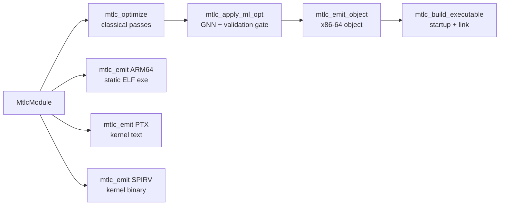

# The libmtlc pipeline

What actually happens between `mtlc_builder_finish` and a running binary. The
stages are independent library calls (see the [API reference](api.md#pipelineh));
this document is what each one does inside.

The GPU/ARM64 emitters branch off **before** `mtlc_optimize` (they consume the
unoptimized IR shape); the x86-64 path runs the whole line.

## The classical optimizer

`mtlc_optimize` runs a fixpoint pass pipeline over every function, with
pre-inline and post-fixpoint phases around it. The pass families, by the
modules that implement them (`src/ir/optimizer/`):

- **Foundation**: common-subexpression elimination, dead-temp removal,
  constant/copy propagation, constant folding, branch simplification and dead
  branch cleanup, rotate fusion, small-function inlining (driven by a function
  index built up front).
- **Loop recognizers**: counted-loop parsing feeding small-loop unrolling and
  reduction unrolling; loop-invariant null-check hoisting; word-count and
  div-by-power-of-two idioms; popcount and Collatz step loops; min/max,
  prefix-sum, lower-bound, dot-product, and memcmp scans.
- **SIMD lowering** (x86-64 AVX2): integer and float horizontal sums, dot
  products, affine maps, fills, clamps, scale/reverse memory maps, byte-map
  chains, insertion-sort and shift-loop kernels, and the general `@simd`
  vectorizer for map/reduce loops. These rewrite loops into dedicated IR
  opcodes that only the x86-64 backend implements, which is why the other
  targets take the unoptimized shape.
- **Memory**: scalar replacement of aggregate locals (SROA), memcpy
  constant-size lowering, load-to-copy cleanup, congruent
  induction-variable elimination.
- **Hotness policy**: a zero-run PGO estimate (or measured frequencies when
  the driver ran `--pgo`) sets code-size versus speed thresholds per site.

Knobs read from the context:

- `opt_level <= 0`: skip everything (successful no-op).
- `whole_program`: enables transforms that are only sound when every call site
  is visible and `main` is the single entry point (for example allocation-site
  layout factorization, which rewrites callee bodies). Set it if and only if
  the module becomes a whole executable.
- `explain` / `explain_focus_file`: emit a remark for each vectorization and
  inlining decision, including the reason when a rewrite was declined.

Contracts: IR may carry optimization contracts (the Mettle frontend spells
them `@simd!`, `@inline!`, `@noalloc`). A violated contract makes
`mtlc_optimize` return 0 after reporting.

Debugging a pass: the environment variable `METTLE_SKIP_PASS=<name,name>`
skips named fixpoint passes, which together with the differential fuzzer
bisects miscompiles to a single pass.

## The ML optimizer

`mtlc_apply_ml_opt` is a learned pass behind a hard validation gate: **the
model proposes, the validator disposes**.

1. A graph neural network (native C inference; no Python at compile time)
   scores spots where a cheaper equivalent form likely exists.
2. A sound transform realizes each proposal on a copy of the function IR.
3. The pre-rewrite and post-rewrite IR are both executed in the reference
   interpreter on identical generated inputs; every observable is compared.
4. Divergence rejects the proposal with a printed counterexample; the function
   keeps its validated IR.

`MtlcMlOptStats` reports proposals / validated / proven / rejected / skipped.
Default builds ship no model, in which case the pass proposes nothing and
returns success. The model is never trusted, only checked.

## The code generators

### x86-64 (the primary path)

`mtlc_emit_object` / `mtlc_emit(MTLC_ARCH_X86_64)` produce a relocatable object
in the host container (COFF on Windows, ELF elsewhere) with hand-encoded
machine code; there is no assembler and no text stage. Functions go through a
register-allocating MIR backend when eligible, with a baseline stack-slot
generator as the fallback, and the SIMD opcodes the optimizer planted become
AVX2 sequences. Globals, string literals, and jump tables are laid out in the
object's data sections with relocations; externs become undefined symbols for
the linker. This is the only target implementing the full IR surface.

### AArch64

`mtlc_emit(MTLC_ARCH_ARM64)` writes a **self-contained static ELF executable**:
a `_start` that calls `main` and exits with its return value, then every
function, with cross-function calls resolved through a shared label table
(AAPCS64: arguments in `x0..`, result in `x0`). The lowering model is simple
and non-optimizing: every temp and local gets a stack slot; each instruction
loads operands, computes, stores.

Subset: the scalar-integer core (labels/jumps/branches, binary/unary ops,
assign, cast, call, return; recursion works). Floats, pointers, `address_of`,
and aggregates are rejected (the call returns 0 with a message). Feed it
unoptimized IR.

### NVIDIA PTX

`mtlc_emit(MTLC_ARCH_PTX)` writes a PTX text module (`.version 8.0`,
`.target sm_90`, forward-compatible: the driver JITs to newer architectures).
**Every function in the module becomes a GPU kernel** (`.visible .entry`);
parameters are scalars and raw device pointers. PTX has unlimited typed virtual
registers, so there is no register allocation; each IR value maps to a fresh
register of its class.

The emitter recognizes intrinsic call names instead of a runtime library:

| Name(s) | Meaning |
|---|---|
| `gpu_tid_{x,y,z}`, `gpu_ntid_{x,y,z}`, `gpu_ctaid_{x,y,z}`, `gpu_nctaid_{x,y,z}` | thread/block index and dimension special registers |
| `gpu_barrier` | `bar.sync 0` (workgroup barrier) |
| `sqrtf`, `rsqrtf`, `fabsf`, `sinf`, `cosf`, `logf`, `expf` | f32 math (fast/approx forms) |
| `h2f`, `f2h` | fp16 bit-pattern to f32 and back (one instruction each) |
| `atomic_add_u32`, `atomic_min_u32`, `atomic_min_u64` | unsigned atomics on `buf[idx]`, returning the old value |

Unsupported in kernels: `address_of`, calls outside that set, aggregates.
Validation: the test suite round-trips emitted PTX through `ptxas` when the
CUDA toolkit is installed.

### SPIR-V

`mtlc_emit(MTLC_ARCH_SPIRV)` writes a binary SPIR-V module for the **OpenCL 1.2
execution environment**: Physical64 addressing, the `Kernel` capability, the
OpenCL memory model, one `OpEntryPoint ... Kernel` per function. This flavor
matches the same kernel ABI as PTX (raw typed pointers, pointer arithmetic),
unlike Vulkan's descriptor-buffer model; an OpenCL runtime consumes it via
`clCreateProgramWithIL`.

Design notes that matter to consumers:

- Kernel pointer parameters are `CrossWorkgroup` pointers, converted to 64-bit
  integers for all arithmetic and back to typed pointers at each load/store
  (the `Addresses` capability), mirroring how the IR carries addresses.
- Control flow maps **directly** onto SPIR-V blocks (`OpBranch` /
  `OpBranchConditional`). The structured-control-flow rules
  (`OpSelectionMerge`/`OpLoopMerge`) bind only the `Shader` capability;
  `Kernel` modules may branch freely, which `spirv-val` confirms.
- Values live in `Function`-storage variables (no `OpPhi`); the consuming
  driver's compiler promotes them.
- The same intrinsic names as PTX map to OpenCL built-ins: thread indices to
  `LocalInvocationId`/`WorkgroupId`/`WorkgroupSize`/`NumWorkgroups`,
  `gpu_barrier` to `OpControlBarrier`, math to `OpExtInst OpenCL.std`,
  atomics to `OpAtomicIAdd`/`OpAtomicUMin`.

Validation: the suite structurally validates every emitted module (magic,
word-stream walk, entry-point integrity) and runs
`spirv-val --target-env opencl1.2` when SPIRV-Tools is installed. Emitted
modules from both the Mettle corpus and builder-built modules pass the Khronos
validator and survive an `spirv-opt -O` round trip.

## Linking

`mtlc_build_executable` = emit object + synthesize startup + link + clean up
temporaries.

**Windows (the internal PE linker).** No external toolchain and no Windows SDK:

1. A startup object is generated in memory code, exporting `mainCRTStartup`:
   it initializes the C runtime arguments (via `__getmainargs` when `main`
   wants `argc/argv`), calls `main`, and exits with its result.
2. `link_resolution_build` merges the startup and program objects, resolving
   symbols with `mainCRTStartup` as the entry.
3. `pe_emit_executable` writes the PE image, building the import table **by
   DLL name** from `kernel32.dll`, `ucrtbase.dll`, and `msvcrt.dll`; an
   undefined symbol that any of those exports becomes an import. That is why
   extern `malloc`/`putchar`/`printf` need no import libraries.

The Mettle driver's `--build` uses the same linker with a wider default DLL
set and user-supplied `--link-arg` libraries; the library entry point keeps
the minimal set.

**ELF hosts.** The object is linked with the system C compiler
(`cc -no-pie <obj> -o <out>`), which supplies crt startup and libc. A
from-scratch ELF executable writer exists only on the ARM64 path today.

## Verifying the pipeline

Independent of unit tests, three mechanisms check the pipeline end to end:

- **Translation validation** (`--verify` in the driver): every pass, on every
  function it changed, is validated by executing before-IR and after-IR in the
  reference interpreter on identical inputs and comparing all observables; a
  divergence names the pass, prints a counterexample, quarantines the pass for
  that function, and recompiles.
- **The differential fuzzer** (`tools/fuzz/`): generated UB-free programs
  compiled at `-O0` and `--release`, failing on any behavioral divergence.
- **The suite gates**: `public_api` (builder to all four targets, native run
  asserted), `calc_frontend` (a real second frontend), `ptx_emit_*` /
  `spirv_emit_*` (external validators when installed), and
  `libmtlc_selfcontained` (the symbol-closure audit).
